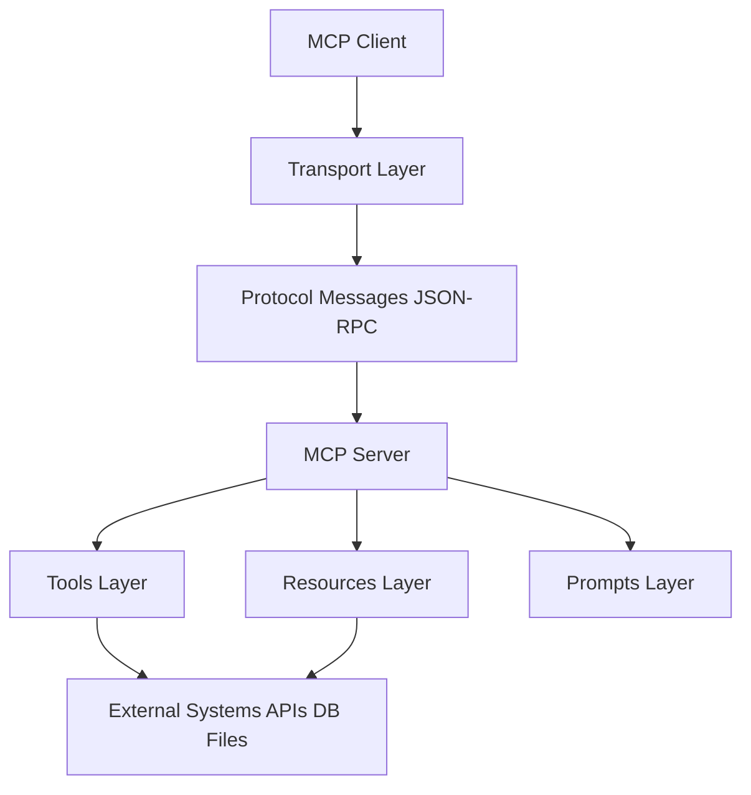
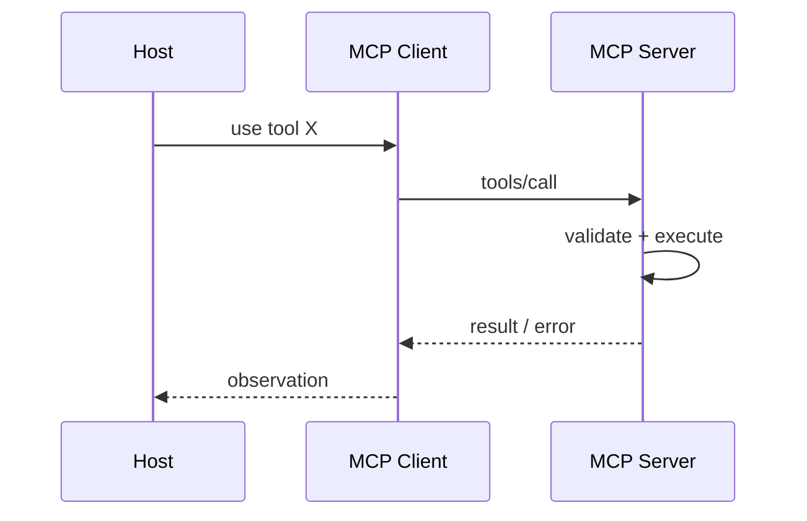

# MCP Architecture

## Overview

Section **2**.

## Layers

| Layer | Responsibility |
|-------|----------------|
| **Client** | Session, discovery, invoke, handle notifications |
| **Transport** | Framing, connection, streaming bytes |
| **Protocol** | JSON-RPC 2.0 messages, IDs, errors |
| **Server** | Route methods, enforce auth, register handlers |
| **Tools** | Executable functions with input/output schema |
| **Resources** | Readable URI-addressed content |
| **Prompts** | Templated prompt messages with arguments |
| **External** | DB, APIs, filesystem behind server impl |

## Message Flow

## Navigation

- [MCP Lifecycle](mcp-lifecycle.md) · [Core Concepts](mcp-core-concepts.md)

---

## Changelog

| Version | Date | Changes |
|---------|------|---------|
| 1.0 | 2026-07-13 | Initial publication |
