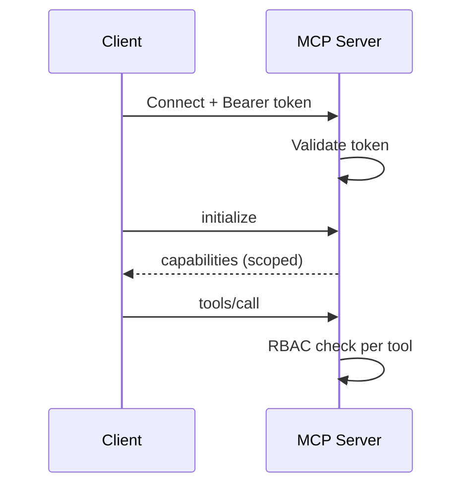

# MCP Authentication & Authorization

## Overview

Section **12**.



## Strategies

| Strategy | Use case |
|----------|----------|
| **API key** | Internal services, dev |
| **OAuth 2.0** | User-delegated SaaS access |
| **mTLS** | Service-to-service enterprise |
| **Session token** | Post-initialize scoped session |

## Authorization Layers

1. **Transport** — TLS + token at connection
2. **Server** — tenant isolation
3. **Tool** — per-tool allow lists
4. **Resource** — URI-level ACLs

## Secret Management

- Never embed secrets in tool schemas
- Use vault references; server resolves at runtime
- Rotate keys; short-lived OAuth tokens

## Production Workflow

1. Authenticate at transport handshake
2. Map principal → roles in `initialize` context
3. Filter `tools/list` / `resources/list` by role
4. Audit every `tools/call` with principal ID

## Security Considerations

- STDIO local servers: OS user boundary is the trust model
- Remote HTTP: mandatory TLS + token validation

## Best Practices

- Principle of least privilege per tool
- Separate read vs write tool namespaces

## Anti-Patterns

- Single shared API key for all tenants
- Auth only at connect, not per sensitive tool

## Python Example

```python
async def authorize_tool_call(principal: str, tool_name: str, roles: dict[str, set[str]]) -> None:
    allowed = roles.get(principal, set())
    if tool_name not in allowed:
        raise PermissionError(f"{principal} cannot call {tool_name}")
```

## Interview Preparation

**Q: Where does auth live in MCP?** Transport establishes identity; server enforces authorization on each method. MCP spec evolves OAuth for remote servers — implement defense in depth.

## Navigation

- [MCP Security](mcp-security.md) · [Multi-Server MCP](multi-server-mcp.md)

---

## Changelog

| Version | Date | Changes |
|---------|------|---------|
| 1.0 | 2026-07-13 | Initial publication |
