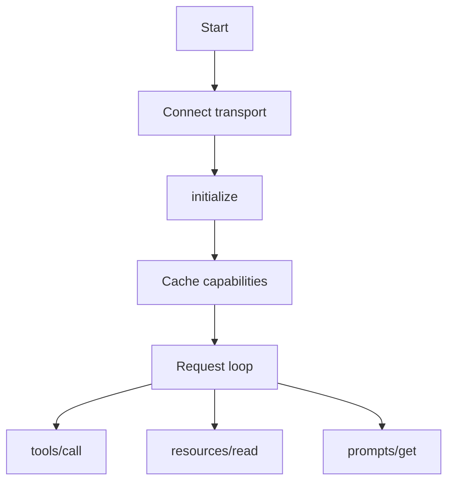

# MCP Client

## Overview

Section **5**.



## Responsibilities

- Manage transport lifecycle (connect, reconnect)
- Send `initialize` / `initialized` handshake
- Cache `tools/list`, `resources/list`, `prompts/list`
- Invoke tools with timeout and retry policy
- Handle server notifications (`tools/list_changed`)
- Propagate errors to host with correlation IDs

## Retry Strategy

| Error | Action |
|-------|--------|
| Transport reset | Reconnect + re-initialize |
| Tool timeout | Retry if idempotent |
| Invalid params | No retry; fix schema |

## Python Example

```python
from mcp import ClientSession, StdioServerParameters
from mcp.client.stdio import stdio_client

async def run_client():
    params = StdioServerParameters(command="python", args=["server.py"])
    async with stdio_client(params) as (read, write):
        async with ClientSession(read, write) as session:
            await session.initialize()
            tools = await session.list_tools()
            result = await session.call_tool(tools.tools[0].name, arguments={})
            return result
```

## Navigation

- [Build an MCP Client](build-an-mcp-client.md)

---

## Changelog

| Version | Date | Changes |
|---------|------|---------|
| 1.0 | 2026-07-13 | Initial publication |
