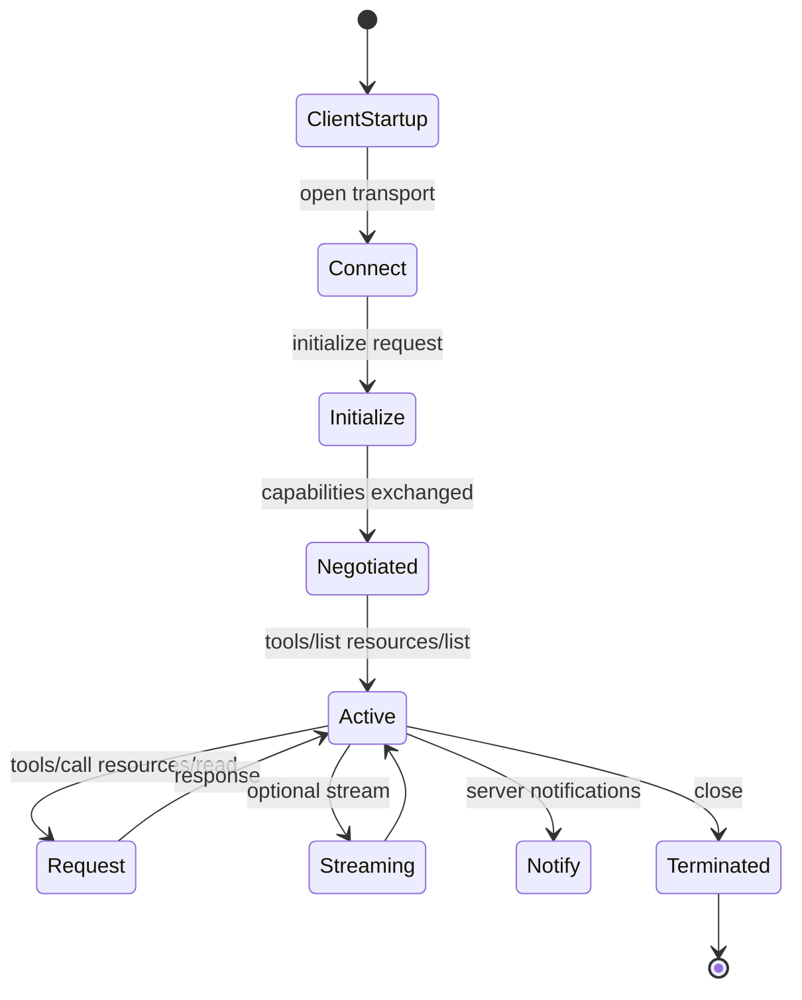

# MCP Lifecycle

## Overview

Section **3** of Phase 9.

## Stages

| Stage | Actions |
|-------|---------|
| **Client startup** | Load server config, spawn or connect |
| **Discovery** | Resolve server endpoint / command |
| **Capability negotiation** | `initialize` with protocol version |
| **Session init** | `initialized` notification from client |
| **Requests** | list/call/read/get operations |
| **Streaming** | Partial results for long operations |
| **Updates** | `list_changed` notifications |
| **Termination** | Close transport, cleanup |

## Navigation

- [MCP Client](mcp-client.md)

---

## Changelog

| Version | Date | Changes |
|---------|------|---------|
| 1.0 | 2026-07-13 | Phase 9 Section 3 |
