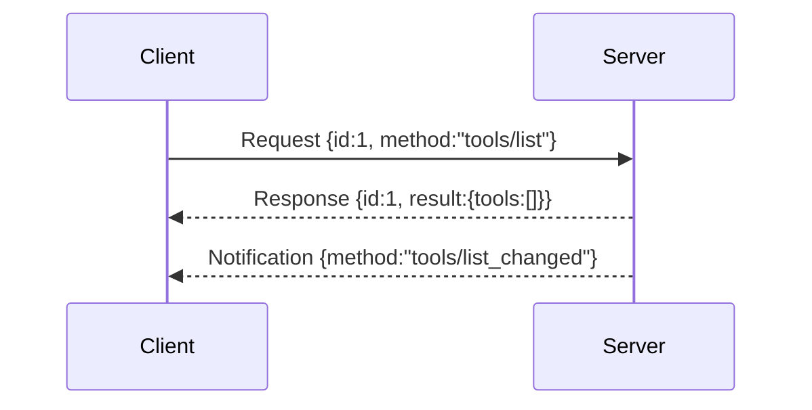

# MCP Message Protocol

## Overview

Section **11** of Phase 9. MCP uses **JSON-RPC 2.0** messages over transports.

## Message Types

| Type | Has `id` | Expects response |
|------|----------|------------------|
| **Request** | Yes | Yes |
| **Notification** | No | No |
| **Response** | Matches request | — |
| **Error** | Matches request | — |



## Request Structure

```json
{"jsonrpc": "2.0", "id": 1, "method": "tools/call", "params": {"name": "echo", "arguments": {"text": "hi"}}}
```

## Error Structure

```json
{"jsonrpc": "2.0", "id": 1, "error": {"code": -32602, "message": "Invalid params", "data": {"field": "name"}}}
```

## Correlation

- Client generates monotonic IDs per session
- Logs must include `mcp.request_id` for tracing
- Notifications have no ID — order matters for `list_changed`

## Serialization

- UTF-8 JSON
- Validate params against method schemas before dispatch

## Production Workflow

1. Parse frame → validate JSON-RPC envelope
2. Route by `method`
3. Validate params
4. Execute → result or structured error
5. Emit metrics: `mcp_requests_total{method,status}`

## Security Considerations

- Reject oversized payloads
- Sanitize error `data` — no stack traces to untrusted clients

## Best Practices

- Use structured error codes
- Version breaking changes in `initialize` negotiation

## Anti-Patterns

- Reusing request IDs across concurrent calls
- Returning binary in JSON without base64 encoding

## Python Example

```python
import json
from dataclasses import dataclass

@dataclass
class JsonRpcRequest:
    id: int
    method: str
    params: dict

    def to_json(self) -> str:
        return json.dumps({"jsonrpc": "2.0", "id": self.id, "method": self.method, "params": self.params})
```

## Interview Preparation

**Q: Request vs notification?** Notifications are fire-and-forget (e.g. `initialized`, `tools/list_changed`). Requests require correlated responses.

## Navigation

- [Authentication](mcp-authentication.md) · [Lifecycle](mcp-lifecycle.md)

---

## Changelog

| Version | Date | Changes |
|---------|------|---------|
| 1.0 | 2026-07-13 | Phase 9 Section 11 |
