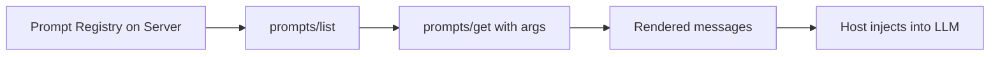

# MCP Prompts

## Overview

Section **8**. Prompts become **protocol assets** — discoverable, versioned templates servers expose via `prompts/list` and `prompts/get`.

## Prompt as Protocol Asset

## Features

| Feature | Description |
|---------|-------------|
| **Registry** | Named prompts with descriptions |
| **Parameters** | JSON Schema for template variables |
| **Metadata** | Tags, version, audience |
| **Validation** | Reject missing required args |
| **Reuse** | Same prompt across hosts |

## Example

Server exposes `code-review` prompt with `language` and `diff` parameters — host fetches rendered messages instead of duplicating template strings.

## Navigation

- [MCP Tools](mcp-tools.md)

---

## Changelog

| Version | Date | Changes |
|---------|------|---------|
| 1.0 | 2026-07-13 | Initial publication |
