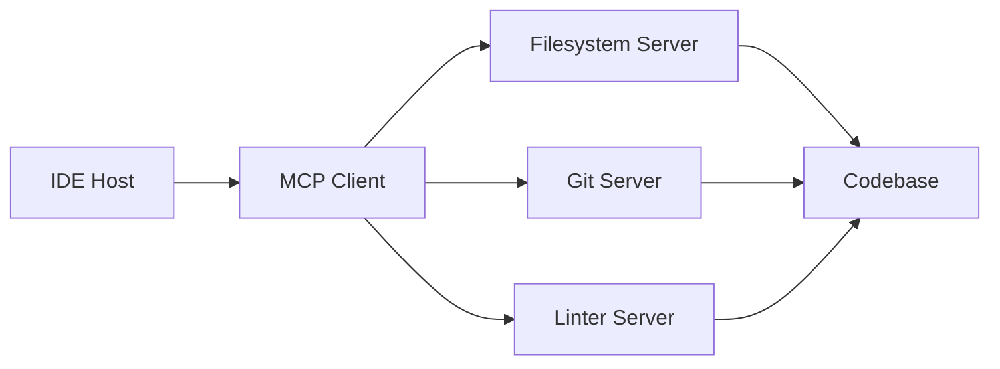
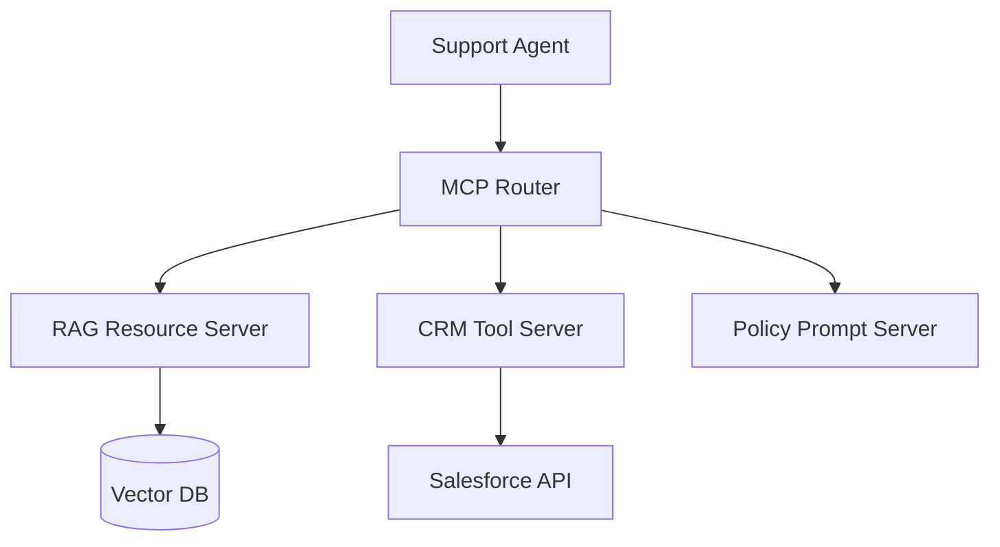

# Real-World MCP Architectures

## Overview

Section **20** of Phase 9 — six production architecture patterns.

---

## 1. AI Coding Assistant

- **Transport:** STDIO subprocess per server
- **Tools:** `read_file`, `search`, `run_tests`
- **Resources:** `file://` URIs for open tabs
- **Security:** Workspace root sandbox

---

## 2. Enterprise Knowledge Platform

- **Resources:** chunked doc URIs with citations
- **Prompts:** `escalation`, `refund_policy` templates
- **Auth:** OAuth per user; CRM tools scoped

---

## 3. AI Research Agent

- **Servers:** web fetch (read-only), arXiv, notebook execution (sandboxed)
- **Streaming:** long PDF summarization via progress notifications
- **Pattern:** read resources → synthesize → cite URIs in output

---

## 4. Multi-Agent Platform

- **Supervisor agent** holds MCP client pool
- **Worker agents** receive delegated tool subsets
- **Router** namespaces tools per agent role
- See [Multi-Agent Systems](../ai-agents/multi-agent-systems.md)

---

## 5. Internal Tool Platform

- Central registry of approved MCP servers
- Golden schemas; CI validates tool contracts
- Developers publish servers; platform team certifies

---

## 6. AI Operations Dashboard

- **Resources:** live metrics streams (`metrics://service/latency`)
- **Tools:** `scale_replicas`, `rollback_deploy` (HITL gated)
- **Observability:** every tool call → audit + trace

---

## Comparison Table

| Architecture | Servers | Transport | Critical concern |
|--------------|---------|-----------|------------------|
| Coding assistant | 3–5 local | STDIO | Filesystem sandbox |
| Enterprise KB | 3+ remote | HTTP | Tenant ACL |
| Research agent | 2–4 | Mixed | Untrusted content |
| Multi-agent | N × M | HTTP | Tool namespace |
| Internal platform | Catalog | HTTP | Schema CI |
| Ops dashboard | 2 | HTTP | HITL on writes |

## Interview Preparation

**Whiteboard:** Design MCP for a bank — read-only market data resources, trade tools with dual approval, air-gapped STDIO for core banking, full audit.

## Navigation

- [Comparison Guides](mcp-comparison-guides.md) · [Phase 9 Hub](README.md)

---

## Changelog

| Version | Date | Changes |
|---------|------|---------|
| 1.0 | 2026-07-13 | Phase 9 Section 20 |
