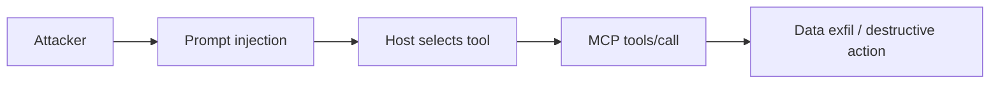

# MCP Security

## Overview

Section **18** of Phase 9. MCP expands the **attack surface** — every tool is arbitrary code execution against external systems.

## Threat Model



## Controls

| Layer | Control |
|-------|---------|
| **Input** | JSON Schema validation; max string lengths |
| **Tool** | Allow lists; no raw SQL/shell without sandbox |
| **Resource** | ACL on URIs; no path traversal |
| **Prompt** | Server-side templates; never execute user code in prompts |
| **Transport** | TLS; token rotation |
| **Output** | Sanitize before injecting into LLM context |
| **Tenant** | Isolate server processes per tenant |

## Prompt Injection via MCP

Malicious resource content can trick the model into calling dangerous tools. Mitigations:

- Human approval for write/destructive tools
- Separate read-only servers for untrusted content
- Tool argument validation independent of model output

## Sandboxing

- Run STDIO servers in containers with minimal filesystem mount
- Network egress allow lists
- seccomp/AppArmor for subprocess servers

## Audit Logging

Log: `timestamp`, `principal`, `method`, `tool_name`, `args_hash`, `outcome` — retain for compliance.

## Best Practices

- Classify tools: read / write / admin
- Rate limit and alert on anomalous call patterns

## Anti-Patterns

- `run_shell(command)` tool exposed to LLM
- Returning secrets in tool results

## Python Example

```python
DESTRUCTIVE_TOOLS = {"delete_ticket", "drop_table"}

async def require_approval(tool_name: str, args: dict) -> bool:
    if tool_name in DESTRUCTIVE_TOOLS:
        return await human_approve(tool_name, args)
    return True
```

## Interview Preparation

**Q: Securing MCP in enterprise.** mTLS, OAuth, per-tool RBAC, audit, sandboxed servers, separate prod/staging servers, no shared credentials.

## Navigation

- [Authentication](mcp-authentication.md) · [Common Mistakes](mcp-engineering-mistakes.md)

---

## Changelog

| Version | Date | Changes |
|---------|------|---------|
| 1.0 | 2026-07-13 | Phase 9 Section 18 |
