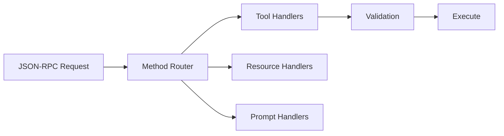

# MCP Server

## Overview

Section **6** of Phase 9.

## Architecture



## Responsibilities

- Register tools/resources/prompts at startup
- Validate inputs against JSON Schema
- Enforce authorization per method
- Return structured errors (not stack traces to client)
- Graceful shutdown: drain in-flight requests

## Python Example

```python
from mcp.server import Server
from mcp.server.stdio import stdio_server
import mcp.types as types

app = Server("demo-server")

@app.list_tools()
async def list_tools() -> list[types.Tool]:
    return [types.Tool(name="echo", description="Echo text", inputSchema={
        "type": "object", "properties": {"text": {"type": "string"}}, "required": ["text"]
    })]

@app.call_tool()
async def call_tool(name: str, arguments: dict) -> list[types.TextContent]:
    if name == "echo":
        return [types.TextContent(type="text", text=arguments["text"])]
    raise ValueError(f"Unknown tool: {name}")

async def main():
    async with stdio_server() as streams:
        await app.run(streams[0], streams[1], app.create_initialization_options())
```

## Navigation

- [Build an MCP Server](build-an-mcp-server.md)

---

## Changelog

| Version | Date | Changes |
|---------|------|---------|
| 1.0 | 2026-07-13 | Phase 9 Section 6 |
