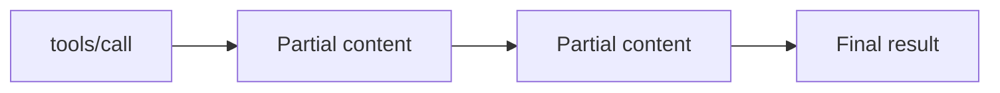

# MCP Streaming

## Overview

Section **13**. Streaming delivers **incremental tool results** and **progress** without blocking the host.



## Patterns

| Pattern | When |
|---------|------|
| **Progress notifications** | Long-running jobs |
| **Content chunks** | Large text/code generation |
| **SSE transport** | Remote streaming to client |
| **Cancellation** | User aborts; server stops work |

## Backpressure

- Client signals max in-flight chunks
- Server batches small updates
- Drop or sample progress if client slow

## Production Workflow

1. Declare streaming capability at `initialize`
2. Tool emits progress via notifications
3. Client aggregates chunks with timeout
4. Support cancel token propagation

## Performance Considerations

- Chunk size 4–64 KB typical
- Avoid per-token MCP messages for LLM streams — stream at tool boundary

## Best Practices

- Idempotent partial handlers on client
- Final message marks `isError` or completion

## Anti-Patterns

- Streaming unbounded logs into model context
- No cancellation on 60s+ operations

## Python Example

```python
async def stream_search(query: str, emit):
    for i, hit in enumerate(await search_index(query)):
        await emit({"type": "progress", "index": i, "hit": hit})
    return {"total": i + 1}
```

## Navigation

- [Multi-Server MCP](multi-server-mcp.md)

---

## Changelog

| Version | Date | Changes |
|---------|------|---------|
| 1.0 | 2026-07-13 | Initial publication |
