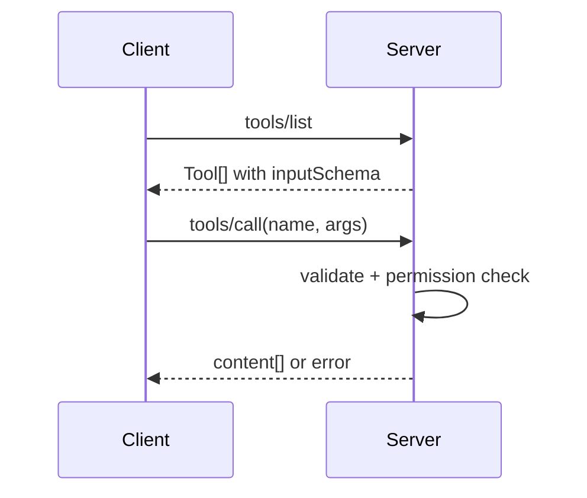

# MCP Tools

## Overview

Section **9** — largest MCP topic.



## Tool Definition

```json
{
  "name": "search_tickets",
  "description": "Search support tickets by query",
  "inputSchema": {
    "type": "object",
    "properties": {"query": {"type": "string"}},
    "required": ["query"]
  }
}
```

## Concerns

| Concern | Pattern |
|---------|---------|
| **Validation** | JSON Schema server-side |
| **Permissions** | RBAC map tool→roles |
| **Long-running** | Progress notifications |
| **Streaming** | Partial content chunks |
| **Errors** | `isError: true` + message |
| **Retries** | Client policy; idempotent tools only |
| **Dynamic tools** | Register at runtime; notify `list_changed` |
| **Composition** | Server calls downstream APIs |

## Python Handler

```python
@app.call_tool()
async def call_tool(name: str, arguments: dict) -> list[types.TextContent]:
    validate_schema(name, arguments)
    await check_permission(current_user(), name)
    try:
        data = await execute_tool(name, arguments)
        return [types.TextContent(type="text", text=json.dumps(data))]
    except ToolError as e:
        return [types.TextContent(type="text", text=str(e))]
```

## Navigation

- [Transport Layer](mcp-transport-layer.md)

---

## Changelog

| Version | Date | Changes |
|---------|------|---------|
| 1.0 | 2026-07-13 | Initial publication |
