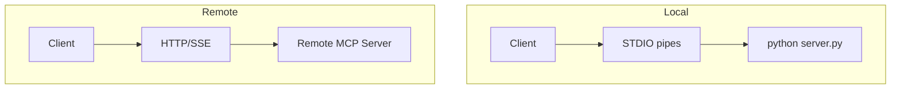

# MCP Transport Layer

## Overview

Section **10**.

| Transport | Use case | Pros | Cons |
|-----------|----------|------|------|
| **STDIO** | Local subprocess servers | Simple, secure local | Not remote |
| **HTTP + SSE** | Remote servers | Firewall-friendly | SSE complexity |
| **Streamable HTTP** | Modern remote | Unified stream | Newer spec |
| **WebSockets** | Bidirectional remote | Low latency | Infra overhead |

## Reliability

- Keep-alive / heartbeat on long connections
- Exponential backoff reconnect
- Session re-`initialize` after transport drop

## Navigation

- [Message Protocol](mcp-message-protocol.md)

---

## Changelog

| Version | Date | Changes |
|---------|------|---------|
| 1.0 | 2026-07-13 | Initial publication |
