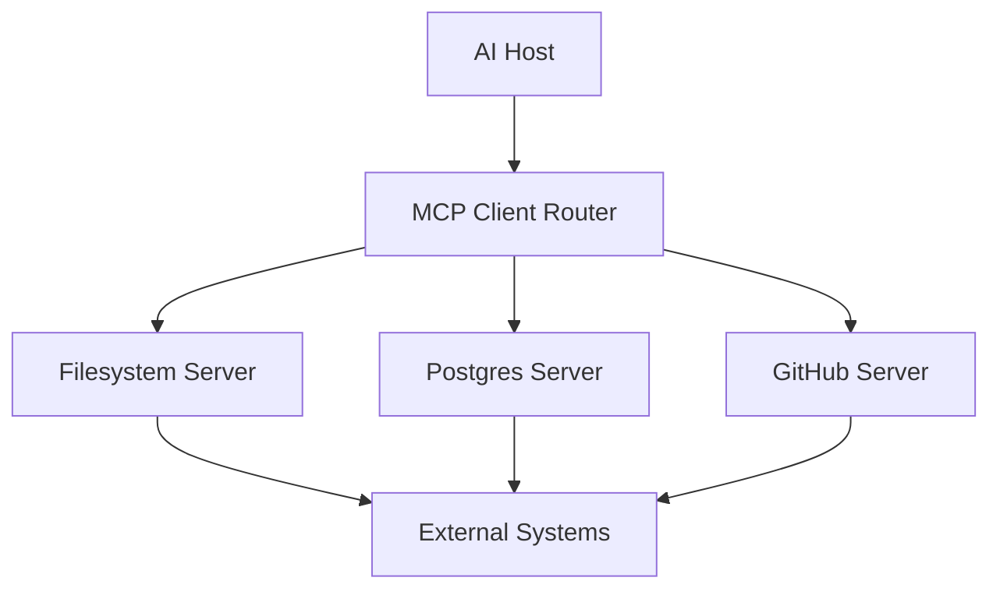

# Multi-Server MCP

## Overview

Section **14**. Production hosts connect to **many MCP servers** — filesystem, database, CRM — through a client orchestration layer.



## Patterns

| Pattern | Description |
|---------|-------------|
| **Flat multi-client** | Host holds N client sessions |
| **Router/aggregator** | Single namespace; prefix tools `github_*` |
| **Federated** | Org-level server registry |
| **Failover** | Primary/secondary server pairs |

## Server Routing

```python
TOOL_ROUTES = {
    "read_file": "filesystem",
    "query_db": "postgres",
    "create_issue": "github",
}

async def route_tool_call(name: str, args: dict, clients: dict):
    server = TOOL_ROUTES[name]
    return await clients[server].call_tool(name, args)
```

## Load Balancing

- Round-robin across identical read replicas
- Sticky sessions if server holds state

## Service Discovery

- Static config (dev)
- Consul/K8s services (prod)
- MCP registry (emerging)

## Scalability

- Isolate failure domains per server
- Circuit breaker per downstream server

## Reliability

- Reconnect one server without tearing down others
- Cache merged `tools/list` with per-server TTL

## Best Practices

- Namespace tools: `db.query`, `git.commit`
- Health check each server before exposing to LLM

## Anti-Patterns

- Merging conflicting tool names without prefix
- Single process hosting unrelated domains

## Interview Preparation

**Q: Design multi-tenant MCP for 1000 users.**

> Per-tenant server instances or shared servers with strict RBAC; central router; audit log; rate limits; separate STDIO for local vs HTTP for remote.

## Navigation

- [Build an MCP Client](build-an-mcp-client.md) · [Real-World Architectures](mcp-real-world-architectures.md)

---

## Changelog

| Version | Date | Changes |
|---------|------|---------|
| 1.0 | 2026-07-13 | Initial publication |
