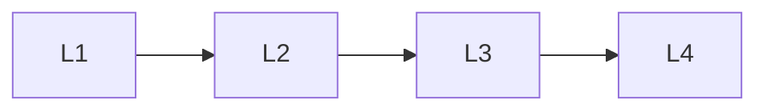

# Primitives

> Section of the **mcp** handbook.

## Lessons

| # | Lesson |
|---|--------|
| 1 | [Mcp Resources](01-mcp-resources.md) |
| 2 | [Mcp Prompts](02-mcp-prompts.md) |
| 3 | [Mcp Tools](03-mcp-tools.md) |
| 4 | [Mcp Message Protocol](04-mcp-message-protocol.md) |

**Topic hub:** [../README.md](../README.md)
