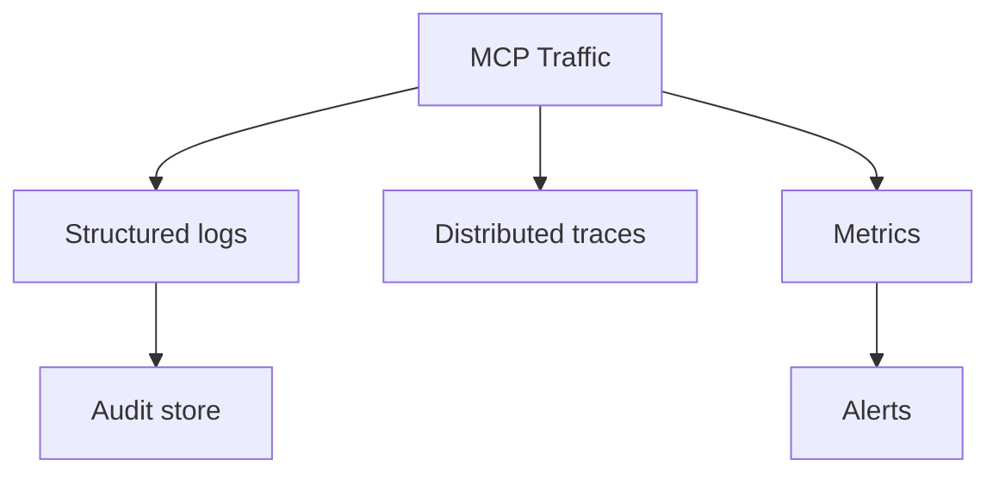

# Production MCP Engineering

## Overview

Section **17** of Phase 9.



## Observability

| Signal | What to capture |
|--------|-----------------|
| **Logs** | `method`, `request_id`, `tool_name`, `latency_ms`, `principal` |
| **Traces** | Span per `tools/call`; child spans for downstream API |
| **Metrics** | QPS, error rate, p99 latency per method |

## Production Workflow

1. Assign correlation ID at client
2. Propagate via JSON-RPC logs
3. Dashboard per server + aggregated host view
4. Alert on error rate > 1% or p99 > SLO

## Scaling

- **Horizontal** — stateless HTTP MCP servers behind load balancer
- **Vertical** — STDIO servers per user session
- **Cache** — `tools/list` / `resources/list` with TTL + invalidation on notifications

## High Availability

- Health checks; remove unhealthy instances
- Failover client to backup server config
- Idempotent tools for safe retries

## Rate Limiting

- Per-principal limits on `tools/call`
- Global concurrency cap on expensive tools

## Cost Optimization

- Batch resource reads
- Avoid redundant `list` calls — subscribe to `list_changed`
- Right-size server count vs connection overhead

## Reliability

- Timeouts on every request (default 30s)
- Circuit breakers on flaky downstream APIs

## Best Practices

- OpenTelemetry instrumentation in client and server
- Separate audit log for write tools

## Anti-Patterns

- Logging full tool arguments containing PII
- No SLOs on MCP path

## Python Example

```python
import time, logging

logger = logging.getLogger("mcp")

async def instrumented_call(session, name, args, request_id: str):
    start = time.perf_counter()
    try:
        result = await session.call_tool(name, args)
        logger.info("tools/call ok", extra={"tool": name, "request_id": request_id, "ms": (time.perf_counter()-start)*1000})
        return result
    except Exception as e:
        logger.error("tools/call fail", extra={"tool": name, "request_id": request_id, "error": str(e)})
        raise
```

## Interview Preparation

**Q: How do you debug slow MCP in production?** Trace `tools/call` → identify server handler → downstream API latency vs serialization.

## Navigation

- [MCP Security](mcp-security.md) · [Common Mistakes](mcp-engineering-mistakes.md)

---

## Changelog

| Version | Date | Changes |
|---------|------|---------|
| 1.0 | 2026-07-13 | Phase 9 Section 17 |
