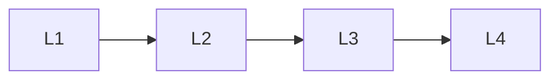

# Transport & Auth

> Section of the **mcp** handbook.

## Lessons

| # | Lesson |
|---|--------|
| 1 | [Mcp Transport Layer](01-mcp-transport-layer.md) |
| 2 | [Mcp Streaming](02-mcp-streaming.md) |
| 3 | [Mcp Authentication](03-mcp-authentication.md) |
| 4 | [Multi Server Mcp](04-multi-server-mcp.md) |

**Topic hub:** [../README.md](../README.md)
