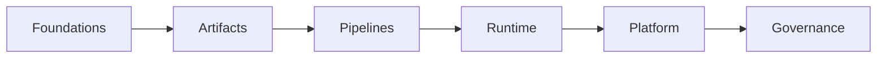

# MLOps & LLMOps

> Operationalizing models, prompts, indexes, and feedback loops — nested Handbooks curriculum from foundations through governance.

**Prerequisites:** [Machine Learning](../machine-learning/README.md) · [LLM Fine-Tuning](../llm-fine-tuning/README.md)  
**Unlocks:** [AI Evaluation](../ai-evaluation/README.md) · [AI Deployment](../ai-deployment/README.md)

Start with a section hub below (or expand the topic in the left sidebar).

---

## Sections

| # | Section | What you will learn | Hub |
|---|---------|---------------------|-----|
| 1 | **Foundations** | MLOps vs LLMOps, lifecycle, ownership | [foundations/](foundations/README.md) |
| 2 | **Artifacts** | Versioning models, prompts, datasets, indexes | [artifacts/](artifacts/README.md) |
| 3 | **Pipelines** | Train/FT CI, eval, deploy | [pipelines/](pipelines/README.md) |
| 4 | **Runtime Ops** | Feedback, drift, registries | [runtime-ops/](runtime-ops/README.md) |
| 5 | **Platform** | Tracking, feature stores, environments | [platform/](platform/README.md) |
| 6 | **Governance** | Approvals, audit, rollback | [governance/](governance/README.md) |

---

## Hierarchy

### Foundations

| # | Topic |
|---|-------|
| 1 | [MLOps vs LLMOps](foundations/01-mlops-vs-llmops.md) |
| 2 | [Lifecycle Overview](foundations/02-lifecycle-overview.md) |
| 3 | [Roles and Ownership](foundations/03-roles-and-ownership.md) |

### Artifacts

| # | Topic |
|---|-------|
| 1 | [Artifact Versioning](artifacts/01-artifact-versioning.md) |
| 2 | [Models and Prompts](artifacts/02-models-and-prompts.md) |
| 3 | [Datasets and Indexes](artifacts/03-datasets-and-indexes.md) |

### Pipelines

| # | Topic |
|---|-------|
| 1 | [Training and Fine-Tune CI](pipelines/01-training-and-ft-ci.md) |
| 2 | [Eval Pipelines](pipelines/02-eval-pipelines.md) |
| 3 | [Deploy Pipelines](pipelines/03-deploy-pipelines.md) |

### Runtime Ops

| # | Topic |
|---|-------|
| 1 | [Feedback Loops](runtime-ops/01-feedback-loops.md) |
| 2 | [Drift Detection](runtime-ops/02-drift-detection.md) |
| 3 | [Prompt and Model Registry](runtime-ops/03-prompt-model-registry.md) |

### Platform

| # | Topic |
|---|-------|
| 1 | [Experiment Tracking](platform/01-experiment-tracking.md) |
| 2 | [Feature Stores (Light)](platform/02-feature-stores-light.md) |
| 3 | [Environments](platform/03-environments.md) |

### Governance

| # | Topic |
|---|-------|
| 1 | [Approvals](governance/01-approvals.md) |
| 2 | [Audit](governance/02-audit.md) |
| 3 | [Rollback](governance/03-rollback.md) |

---

## Definition

**MLOps & LLMOps** is the discipline of versioning, evaluating, releasing, monitoring, and rolling back ML and LLM artifacts safely in production.

---

## Related topics

- [LLM Fine-Tuning](../llm-fine-tuning/README.md)
- [AI Evaluation](../ai-evaluation/README.md)
- [AI Deployment](../ai-deployment/README.md)
- [Domains overview](../README.md)
- [Master Index](../../meta/indexes/MASTER-INDEX.md)

---

## Continue learning

Next: [AI Deployment](../ai-deployment/README.md)

