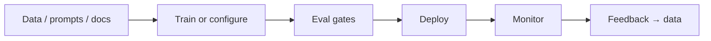

# MLOps & LLMOps

> Operating ML and LLM systems in production — pipelines, versioning, evaluation gates, monitoring, and feedback loops.

**Prerequisites:** [Machine Learning](../machine-learning/README.md) · [LLM Evaluation](../ai-evaluation/README.md)  
**Unlocks:** [AI Deployment & Infrastructure](../ai-deployment/README.md) · [AI Security & Guardrails](../ai-security-guardrails/README.md)

---

## Definition

**MLOps** is the discipline of productionizing ML (data/model pipelines, CI/CD, monitoring). **LLMOps** extends this to prompts, contexts, tools, RAG corpora, and generative quality — where artifacts are not only weights but also prompts and retrieval configs.

---

## Learning path

---

## Documents

| # | Topic | Document |
|---|-------|----------|
| 1 | MLOps vs LLMOps | [mlops-vs-llmops.md](mlops-vs-llmops.md) |
| 2 | Artifact versioning | [artifact-versioning.md](artifact-versioning.md) |
| 3 | Feedback loops | [feedback-loops.md](feedback-loops.md) |

---

## Related topics

- [AI Evaluation](../ai-evaluation/README.md)
- [AI Deployment](../ai-deployment/README.md)
- [Monitoring](../monitoring/README.md)

---

## See also

- [Domains overview](../README.md)
- [Learning Roadmap](../../meta/roadmap.md)
- [Master Index](../../meta/indexes/MASTER-INDEX.md)
