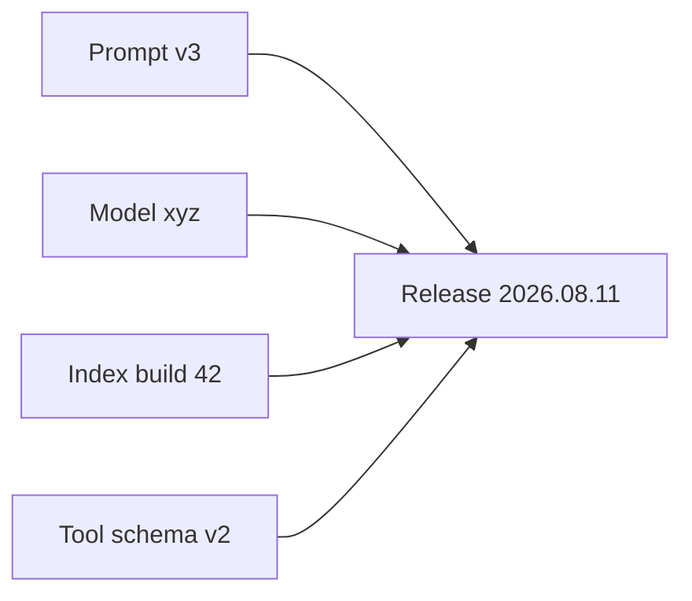

# Artifact Versioning

> Version models, prompts, indexes, and configs together.

## Definition

An LLM system release is a bundle: model ID, prompt templates, tool schemas, retrieval index build, and decoding params. Version and changelog them so you can reproduce and roll back.

## Why it matters

Irreproducible 'someone edited the system prompt' is an outage waiting to happen.

## How it works

## Key principles

1. **Immutable releases** — Tags, not silent edits.
2. **Link traces to versions** — Debug needs lineage.
3. **Compat tests** — Tool schema vs agent code.

## Common applications

| Application | Description |
|-------------|-------------|
| Prompt PRs | Reviewed like code |
| Index builds | Pinned in deploy manifests |
| Canary releases | Version-aware routing |

## Common mistakes

- Editing prompts directly in the production UI with no record
- Orphan indexes not tied to app versions

## Further reading

- [AI Deployment](../ai-deployment/README.md)
- [Feedback loops](feedback-loops.md)
