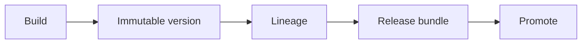

# Artifact Versioning

> Immutable, addressable versions for datasets, models, prompts, indexes, and configs with lineage metadata linking them into release bundles.

## Table of Contents

- [Overview](#overview)
- [Definition](#definition)
- [Why It Matters](#why-it-matters)
- [Uses](#uses)
- [How It Works](#how-it-works)
- [Worked Example](#worked-example)
- [Python Examples](#python-examples)
- [Production Considerations](#production-considerations)
- [Performance Considerations](#performance-considerations)
- [Cost Considerations](#cost-considerations)
- [Security Considerations](#security-considerations)
- [Best Practices](#best-practices)
- [Common Mistakes](#common-mistakes)
- [Interview Preparation](#interview-preparation)
- [Navigation](#navigation)

---

## Overview

This lesson covers **Artifact Versioning** inside the `artifacts` section of the `mlops-llmops` handbook. Treat it as production engineering guidance: clear definitions, when to apply the idea, system shape, and code you can adapt.

---

## Definition

**Artifact Versioning** — Immutable, addressable versions for datasets, models, prompts, indexes, and configs with lineage metadata linking them into release bundles.

---

## Why It Matters

If you cannot point to exact bytes and metadata that served traffic, you cannot reproduce, debug, or roll back. Versioning is the backbone of MLOps/LLMOps.

Without a clear model for this topic, teams ship demos that fail under load, cost, or correctness pressure.

---

## Uses

| Use case | How this applies |
|----------|------------------|
| Models/adapters | Registry stages staging→prod |
| Prompts | Semver or content-hash ids |
| Indexes | Build id + source snapshot |
| Datasets | Snapshot + hash + card |

---

## How It Works

Never overwrite prod tags in place — move stage pointers. Record parent versions and code SHA. Prefer content digests for prompts and small configs.



---

## Worked Example

Incident: answers degraded. Lineage shows prompt `ans-v12` + index `idx-2026-08-01` + model `gpt-x`. Rollback moves prod pointer to previous bundle.

---

## Python Examples

```python
from dataclasses import dataclass, field
from hashlib import sha256
from time import time
from typing import Any

@dataclass
class ArtifactVersion:
    name: str
    version: str
    kind: str
    uri: str
    digest: str
    parents: list[str] = field(default_factory=list)
    meta: dict[str, Any] = field(default_factory=dict)
    created: float = field(default_factory=time)

class Registry:
    def __init__(self):
        self.artifacts: dict[str, ArtifactVersion] = {}
        self.stages: dict[str, dict[str, str]] = {}  # name -> stage -> version

    def publish(self, art: ArtifactVersion) -> None:
        key = f"{art.name}@{art.version}"
        if key in self.artifacts:
            raise ValueError("immutable_conflict")
        self.artifacts[key] = art

    def set_stage(self, name: str, stage: str, version: str) -> None:
        key = f"{name}@{version}"
        if key not in self.artifacts:
            raise KeyError(key)
        self.stages.setdefault(name, {})[stage] = version

    def get_stage(self, name: str, stage: str) -> ArtifactVersion:
        ver = self.stages[name][stage]
        return self.artifacts[f"{name}@{ver}"]

def prompt_digest(text: str) -> str:
    return sha256(text.encode()).hexdigest()[:12]

def make_prompt_version(name: str, text: str, parents: list[str] | None = None) -> ArtifactVersion:
    d = prompt_digest(text)
    return ArtifactVersion(name, d, "prompt", f"prompts/{name}/{d}.txt", d, parents or [], {"chars": len(text)})

```

---

## Production Considerations

- Log request IDs across orchestration steps.
- Fail closed on auth and policy; degrade only where product explicitly allows it.
- Keep feature flags for prompt/model swaps.

## Performance Considerations

- Bound concurrency to the model provider.
- Stream when UX needs time-to-first-token.
- Cache stable sub-results carefully with invalidation rules.

## Cost Considerations

- Track tokens and tool calls per feature / tenant.
- Prefer smaller models for routers and classifiers.
- Cap max tokens and tool-loop iterations.

## Security Considerations

- Never put secrets in prompts.
- Treat model output as untrusted until validated.
- Enforce tenant isolation on retrieval and tools.

---

## Best Practices

1. Version models, prompts, datasets, and indexes as first-class artifacts.
2. Gate promotions on eval suites with explicit floors.
3. Track online drift and user feedback into curated datasets.
4. Keep environment parity for staging and prod serving.
5. Own rollback paths for every promoted change.

---

## Common Mistakes

- Shipping prompt changes without registry or eval.
- Training on leaking eval data.
- No owner for production model incidents.
- Indexes rebuilt silently without version pins.
- Feedback collected but never sampled into training/eval.

---

## Interview Preparation

**Q: How does LLMOps differ from classic MLOps?**

A: LLMOps adds prompts, traces, retrieval indexes, and judge/eval pipelines as versioned artifacts alongside models and datasets — with different drift and cost profiles.

**Q: What must be versioned for an LLM feature?**

A: Code, prompt templates, model/adapter ids, retrieval index build, tool schemas, and the eval suite that certified the release.

**Q: How do you roll back safely?**

A: Pin previous artifact bundle (model+prompt+index), flip traffic via registry stage, verify online metrics, and keep data plane compatible.

---

## Navigation

- **Section hub:** [README](README.md)
- **Topic hub:** [../README.md](../README.md)
