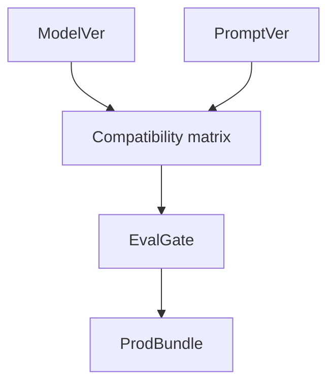

# Models and Prompts

> Managing model/adapter artifacts together with prompt templates as coupled release units when behavior depends on both.

## Table of Contents

- [Overview](#overview)
- [Definition](#definition)
- [Why It Matters](#why-it-matters)
- [Uses](#uses)
- [How It Works](#how-it-works)
- [Worked Example](#worked-example)
- [Python Examples](#python-examples)
- [Production Considerations](#production-considerations)
- [Performance Considerations](#performance-considerations)
- [Cost Considerations](#cost-considerations)
- [Security Considerations](#security-considerations)
- [Best Practices](#best-practices)
- [Common Mistakes](#common-mistakes)
- [Interview Preparation](#interview-preparation)
- [Navigation](#navigation)

---

## Overview

This lesson covers **Models and Prompts** inside the `artifacts` section of the `mlops-llmops` handbook. Treat it as production engineering guidance: clear definitions, when to apply the idea, system shape, and code you can adapt.

---

## Definition

**Models and Prompts** — Managing model/adapter artifacts together with prompt templates as coupled release units when behavior depends on both.

---

## Why It Matters

Prompt-only or model-only changes both alter behavior. Treating them as independent unmarked edits causes 'who broke prod' mysteries.

Without a clear model for this topic, teams ship demos that fail under load, cost, or correctness pressure.

---

## Uses

| Use case | How this applies |
|----------|------------------|
| Provider model swap | Re-eval prompts on new model |
| LoRA promote | Pin base model id + adapter |
| Prompt A/B | Same model, two prompt versions |
| Tool schema change | Bump prompt + schema together |

---

## How It Works

Maintain a compatibility matrix: which prompt versions are certified on which models. Gate joint promotion. Store rendered prompt templates with variables schema.



---

## Worked Example

Upgrade to new provider snapshot: old prompt fails JSON mode on 12% cases; new prompt `v13` certified → joint prod pointer move.

---

## Python Examples

```python
from dataclasses import dataclass

@dataclass
class ModelRef:
    provider: str
    model_id: str
    adapter_id: str | None = None

@dataclass
class PromptRef:
    name: str
    version: str
    variables: list[str]

@dataclass
class CompatEntry:
    model: ModelRef
    prompt: PromptRef
    eval_score: float
    certified: bool

def certify(matrix: list[CompatEntry], model: ModelRef, prompt: PromptRef, floor: float = 0.85) -> bool:
    for e in matrix:
        if e.model == model and e.prompt.name == prompt.name and e.prompt.version == prompt.version:
            return e.certified and e.eval_score >= floor
    return False

def render(template: str, variables: dict[str, str]) -> str:
    out = template
    for k, v in variables.items():
        out = out.replace("{{" + k + "}}", v)
    return out

def joint_release_ok(matrix, model, prompt, floor=0.85) -> bool:
    return certify(matrix, model, prompt, floor)

```

---

## Production Considerations

- Log request IDs across orchestration steps.
- Fail closed on auth and policy; degrade only where product explicitly allows it.
- Keep feature flags for prompt/model swaps.

## Performance Considerations

- Bound concurrency to the model provider.
- Stream when UX needs time-to-first-token.
- Cache stable sub-results carefully with invalidation rules.

## Cost Considerations

- Track tokens and tool calls per feature / tenant.
- Prefer smaller models for routers and classifiers.
- Cap max tokens and tool-loop iterations.

## Security Considerations

- Never put secrets in prompts.
- Treat model output as untrusted until validated.
- Enforce tenant isolation on retrieval and tools.

---

## Best Practices

1. Version models, prompts, datasets, and indexes as first-class artifacts.
2. Gate promotions on eval suites with explicit floors.
3. Track online drift and user feedback into curated datasets.
4. Keep environment parity for staging and prod serving.
5. Own rollback paths for every promoted change.

---

## Common Mistakes

- Shipping prompt changes without registry or eval.
- Training on leaking eval data.
- No owner for production model incidents.
- Indexes rebuilt silently without version pins.
- Feedback collected but never sampled into training/eval.

---

## Interview Preparation

**Q: How does LLMOps differ from classic MLOps?**

A: LLMOps adds prompts, traces, retrieval indexes, and judge/eval pipelines as versioned artifacts alongside models and datasets — with different drift and cost profiles.

**Q: What must be versioned for an LLM feature?**

A: Code, prompt templates, model/adapter ids, retrieval index build, tool schemas, and the eval suite that certified the release.

**Q: How do you roll back safely?**

A: Pin previous artifact bundle (model+prompt+index), flip traffic via registry stage, verify online metrics, and keep data plane compatible.

---

## Navigation

- **Section hub:** [README](README.md)
- **Topic hub:** [../README.md](../README.md)
