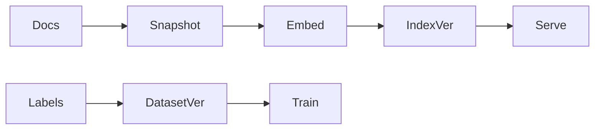

# Datasets and Indexes

> Versioning training/eval datasets and retrieval indexes — snapshots, schemas, build provenance, and freshness SLAs.

## Table of Contents

- [Overview](#overview)
- [Definition](#definition)
- [Why It Matters](#why-it-matters)
- [Uses](#uses)
- [How It Works](#how-it-works)
- [Worked Example](#worked-example)
- [Python Examples](#python-examples)
- [Production Considerations](#production-considerations)
- [Performance Considerations](#performance-considerations)
- [Cost Considerations](#cost-considerations)
- [Security Considerations](#security-considerations)
- [Best Practices](#best-practices)
- [Common Mistakes](#common-mistakes)
- [Interview Preparation](#interview-preparation)
- [Navigation](#navigation)

---

## Overview

This lesson covers **Datasets and Indexes** inside the `artifacts` section of the `mlops-llmops` handbook. Treat it as production engineering guidance: clear definitions, when to apply the idea, system shape, and code you can adapt.

---

## Definition

**Datasets and Indexes** — Versioning training/eval datasets and retrieval indexes — snapshots, schemas, build provenance, and freshness SLAs.

---

## Why It Matters

Silent index rebuilds and mutable dataset paths poison both training and RAG. Immutable snapshots keep evals honest.

Without a clear model for this topic, teams ship demos that fail under load, cost, or correctness pressure.

---

## Uses

| Use case | How this applies |
|----------|------------------|
| SFT data | Frozen train/val/test splits |
| Golden eval | Never train on it |
| RAG index | Build from doc snapshot + embedder id |
| Feature tables | Point-in-time correct joins |

---

## How It Works

Pin embedder model id into index versions. Record document corpus hash. Separate golden eval sets with access controls. Publish freshness SLO (e.g., index ≤24h behind docs).



---

## Worked Example

Legal docs updated; index `idx-2026-08-12` built from corpus hash `ab12`; serving pins that version until eval on citation suite passes.

---

## Python Examples

```python
from dataclasses import dataclass
from hashlib import sha256

@dataclass
class DatasetVersion:
    name: str
    version: str
    uri: str
    n_rows: int
    split: str
    digest: str

@dataclass
class IndexVersion:
    name: str
    version: str
    corpus_digest: str
    embedder_id: str
    uri: str
    n_chunks: int

def digest_uri(uri: str, content: bytes) -> str:
    return sha256(content).hexdigest()

def index_stale(index_corpus: str, live_corpus: str) -> bool:
    return index_corpus != live_corpus

def safe_train_split(train: DatasetVersion, golden: DatasetVersion) -> bool:
    return train.digest != golden.digest and train.uri != golden.uri

def build_index_id(corpus_digest: str, embedder_id: str) -> str:
    raw = f"{corpus_digest}:{embedder_id}".encode()
    return sha256(raw).hexdigest()[:12]

```

---

## Production Considerations

- Log request IDs across orchestration steps.
- Fail closed on auth and policy; degrade only where product explicitly allows it.
- Keep feature flags for prompt/model swaps.

## Performance Considerations

- Bound concurrency to the model provider.
- Stream when UX needs time-to-first-token.
- Cache stable sub-results carefully with invalidation rules.

## Cost Considerations

- Track tokens and tool calls per feature / tenant.
- Prefer smaller models for routers and classifiers.
- Cap max tokens and tool-loop iterations.

## Security Considerations

- Never put secrets in prompts.
- Treat model output as untrusted until validated.
- Enforce tenant isolation on retrieval and tools.

---

## Best Practices

1. Version models, prompts, datasets, and indexes as first-class artifacts.
2. Gate promotions on eval suites with explicit floors.
3. Track online drift and user feedback into curated datasets.
4. Keep environment parity for staging and prod serving.
5. Own rollback paths for every promoted change.

---

## Common Mistakes

- Shipping prompt changes without registry or eval.
- Training on leaking eval data.
- No owner for production model incidents.
- Indexes rebuilt silently without version pins.
- Feedback collected but never sampled into training/eval.

---

## Interview Preparation

**Q: How does LLMOps differ from classic MLOps?**

A: LLMOps adds prompts, traces, retrieval indexes, and judge/eval pipelines as versioned artifacts alongside models and datasets — with different drift and cost profiles.

**Q: What must be versioned for an LLM feature?**

A: Code, prompt templates, model/adapter ids, retrieval index build, tool schemas, and the eval suite that certified the release.

**Q: How do you roll back safely?**

A: Pin previous artifact bundle (model+prompt+index), flip traffic via registry stage, verify online metrics, and keep data plane compatible.

---

## Navigation

- **Section hub:** [README](README.md)
- **Topic hub:** [../README.md](../README.md)
