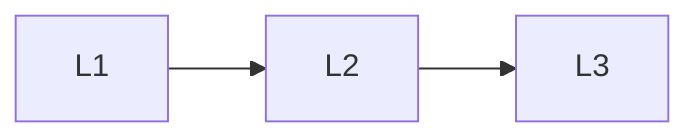

# Artifacts

> Section of the **mlops-llmops** handbook.

## Lessons

| # | Lesson |
|---|--------|
| 1 | [Artifact Versioning](01-artifact-versioning.md) |
| 2 | [Models and Prompts](02-models-and-prompts.md) |
| 3 | [Datasets and Indexes](03-datasets-and-indexes.md) |

**Topic hub:** [../README.md](../README.md)
