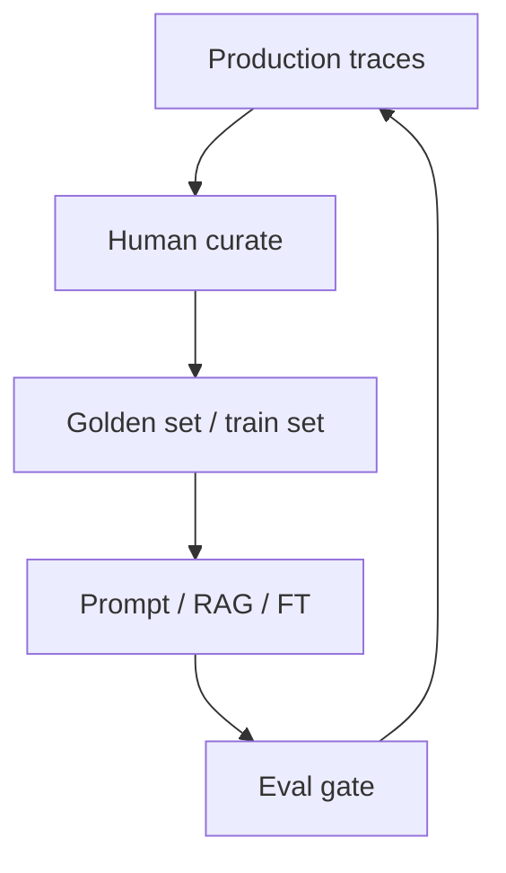

# Feedback Loops

> How production signals become better data, prompts, and models.

## Definition

Feedback loops capture failures, thumbs-down, and traces; curate them into datasets; improve prompts/RAG/FT; and re-release through eval gates.

## Why it matters

Without a loop, quality randomly walks. With a messy loop, you amplify bias and leakage.

## How it works

## Key principles

1. **Close the loop weekly** — Small steady improvements.
2. **Privacy scrub first** — Redact before training/eval storage.
3. **Separate eval from train** — No contamination.

## Common applications

| Application | Description |
|-------------|-------------|
| Support bots | Failed tickets → KB |
| Agents | Failed trajectories → tests |
| Search | Poor recall queries → doc gaps |

## Common mistakes

- Training on unredacted PII
- Letting users poison golden sets unchecked

## Further reading

- [LLM Evaluation](../ai-evaluation/README.md)
- [LLM Fine-Tuning](../llm-fine-tuning/README.md)
