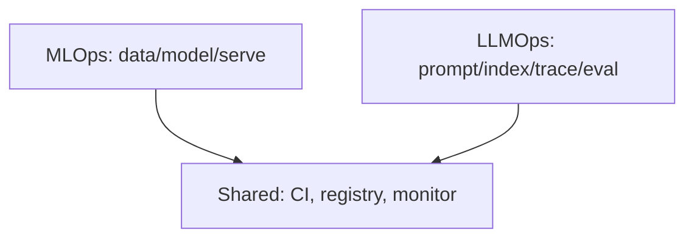

# MLOps vs LLMOps

> MLOps operationalizes training and serving classical ML models; LLMOps extends that discipline to prompts, traces, retrieval indexes, tool schemas, and LLM-specific eval/cost loops.

## Table of Contents

- [Overview](#overview)
- [Definition](#definition)
- [Why It Matters](#why-it-matters)
- [Uses](#uses)
- [How It Works](#how-it-works)
- [Worked Example](#worked-example)
- [Python Examples](#python-examples)
- [Production Considerations](#production-considerations)
- [Performance Considerations](#performance-considerations)
- [Cost Considerations](#cost-considerations)
- [Security Considerations](#security-considerations)
- [Best Practices](#best-practices)
- [Common Mistakes](#common-mistakes)
- [Interview Preparation](#interview-preparation)
- [Navigation](#navigation)

---

## Overview

This lesson covers **MLOps vs LLMOps** inside the `foundations` section of the `mlops-llmops` handbook. Treat it as production engineering guidance: clear definitions, when to apply the idea, system shape, and code you can adapt.

---

## Definition

**MLOps vs LLMOps** — MLOps operationalizes training and serving classical ML models; LLMOps extends that discipline to prompts, traces, retrieval indexes, tool schemas, and LLM-specific eval/cost loops.

---

## Why It Matters

Teams that copy MLOps checklists wholesale miss prompt/index drift and token economics. Teams that ignore MLOps reinvent broken release hygiene. Knowing the delta keeps both model and LLM products shippable.

Without a clear model for this topic, teams ship demos that fail under load, cost, or correctness pressure.

---

## Uses

| Use case | How this applies |
|----------|------------------|
| Classical CV/NLP | Dataset → train → model registry → serve |
| RAG apps | Docs → index version → prompt → model |
| Agents | Tools + prompts + trajectory eval |
| Hybrid | Classifier + LLM rewriter in one pipeline |

---

## How It Works

Reuse CI, environments, approvals, and monitoring ideas from MLOps. Add artifact types (prompt, index, judge), online trace stores, and token/cost SLIs. Do not treat the prompt as 'just config' outside the registry.



---

## Worked Example

Search feature: classic MLOps owns ranking model; LLMOps owns answer prompt + chunk index build + groundedness eval. Joint release requires both registries green.

---

## Python Examples

```python
from dataclasses import dataclass
from enum import Enum

class ArtifactKind(Enum):
    MODEL = "model"
    DATASET = "dataset"
    PROMPT = "prompt"
    INDEX = "index"
    JUDGE = "judge"
    TOOL_SCHEMA = "tool_schema"

@dataclass
class ReleaseBundle:
    feature: str
    artifacts: dict[str, str]  # kind -> version
    eval_suite: str
    owner: str

def required_kinds(is_rag: bool, is_agent: bool) -> set[ArtifactKind]:
    kinds = {ArtifactKind.MODEL, ArtifactKind.PROMPT, ArtifactKind.DATASET}
    if is_rag:
        kinds.add(ArtifactKind.INDEX)
    if is_agent:
        kinds.add(ArtifactKind.TOOL_SCHEMA)
        kinds.add(ArtifactKind.JUDGE)
    return kinds

def bundle_complete(b: ReleaseBundle, needed: set[ArtifactKind]) -> list[str]:
    missing = []
    for k in needed:
        if k.value not in b.artifacts:
            missing.append(k.value)
    if not b.eval_suite:
        missing.append("eval_suite")
    if not b.owner:
        missing.append("owner")
    return missing

def llmops_delta() -> list[str]:
    return [
        "prompt_registry",
        "index_versioning",
        "trace_store",
        "token_cost_sli",
        "trajectory_or_judge_evals",
    ]

```

---

## Production Considerations

- Log request IDs across orchestration steps.
- Fail closed on auth and policy; degrade only where product explicitly allows it.
- Keep feature flags for prompt/model swaps.

## Performance Considerations

- Bound concurrency to the model provider.
- Stream when UX needs time-to-first-token.
- Cache stable sub-results carefully with invalidation rules.

## Cost Considerations

- Track tokens and tool calls per feature / tenant.
- Prefer smaller models for routers and classifiers.
- Cap max tokens and tool-loop iterations.

## Security Considerations

- Never put secrets in prompts.
- Treat model output as untrusted until validated.
- Enforce tenant isolation on retrieval and tools.

---

## Best Practices

1. Version models, prompts, datasets, and indexes as first-class artifacts.
2. Gate promotions on eval suites with explicit floors.
3. Track online drift and user feedback into curated datasets.
4. Keep environment parity for staging and prod serving.
5. Own rollback paths for every promoted change.

---

## Common Mistakes

- Shipping prompt changes without registry or eval.
- Training on leaking eval data.
- No owner for production model incidents.
- Indexes rebuilt silently without version pins.
- Feedback collected but never sampled into training/eval.

---

## Interview Preparation

**Q: How does LLMOps differ from classic MLOps?**

A: LLMOps adds prompts, traces, retrieval indexes, and judge/eval pipelines as versioned artifacts alongside models and datasets — with different drift and cost profiles.

**Q: What must be versioned for an LLM feature?**

A: Code, prompt templates, model/adapter ids, retrieval index build, tool schemas, and the eval suite that certified the release.

**Q: How do you roll back safely?**

A: Pin previous artifact bundle (model+prompt+index), flip traffic via registry stage, verify online metrics, and keep data plane compatible.

---

## Navigation

- **Section hub:** [README](README.md)
- **Topic hub:** [../README.md](../README.md)
