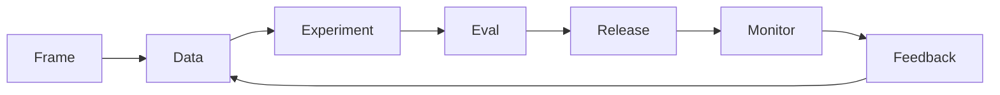

# Lifecycle Overview

> The end-to-end lifecycle for ML/LLM systems: problem framing → data → experiment → eval → release → monitor → feedback → improve.

## Table of Contents

- [Overview](#overview)
- [Definition](#definition)
- [Why It Matters](#why-it-matters)
- [Uses](#uses)
- [How It Works](#how-it-works)
- [Worked Example](#worked-example)
- [Python Examples](#python-examples)
- [Production Considerations](#production-considerations)
- [Performance Considerations](#performance-considerations)
- [Cost Considerations](#cost-considerations)
- [Security Considerations](#security-considerations)
- [Best Practices](#best-practices)
- [Common Mistakes](#common-mistakes)
- [Interview Preparation](#interview-preparation)
- [Navigation](#navigation)

---

## Overview

This lesson covers **Lifecycle Overview** inside the `foundations` section of the `mlops-llmops` handbook. Treat it as production engineering guidance: clear definitions, when to apply the idea, system shape, and code you can adapt.

---

## Definition

**Lifecycle Overview** — The end-to-end lifecycle for ML/LLM systems: problem framing → data → experiment → eval → release → monitor → feedback → improve.

---

## Why It Matters

Without a shared lifecycle map, work stalls between research notebooks and production fires. The lifecycle assigns stages, gates, and owners.

Without a clear model for this topic, teams ship demos that fail under load, cost, or correctness pressure.

---

## Uses

| Use case | How this applies |
|----------|------------------|
| New feature | Walk full lifecycle once |
| Prompt tweak | Short-circuit via prompt registry + eval |
| Retrain | Data → train → eval → canary |
| Incident | Monitor → rollback → postmortem → data fix |

---

## How It Works

Each stage has entry/exit criteria. Experiments may be chaotic; releases must be boring. Feedback must re-enter data/eval deliberately, not as endless prompt hotfixes only.



---

## Worked Example

Churn prediction + LLM explanation: data weekly refresh, model monthly, explanation prompt weekly behind eval gate, monitor weekly business metrics.

---

## Python Examples

```python
from dataclasses import dataclass
from enum import Enum

class Stage(Enum):
    FRAME = "frame"
    DATA = "data"
    EXPERIMENT = "experiment"
    EVAL = "eval"
    RELEASE = "release"
    MONITOR = "monitor"
    FEEDBACK = "feedback"

GATES = {
    Stage.DATA: ["schema_valid", "pii_scan"],
    Stage.EVAL: ["offline_floors", "safety_suite"],
    Stage.RELEASE: ["canary_plan", "rollback_tested"],
    Stage.MONITOR: ["sli_dashboards", "oncall"],
}

@dataclass
class LifecycleState:
    stage: Stage
    checks: dict[str, bool]

def can_advance(state: LifecycleState) -> bool:
    needed = GATES.get(state.stage, [])
    return all(state.checks.get(c, False) for c in needed)

ORDER = list(Stage)

def next_stage(stage: Stage) -> Stage | None:
    i = ORDER.index(stage)
    return ORDER[i + 1] if i + 1 < len(ORDER) else None

```

---

## Production Considerations

- Log request IDs across orchestration steps.
- Fail closed on auth and policy; degrade only where product explicitly allows it.
- Keep feature flags for prompt/model swaps.

## Performance Considerations

- Bound concurrency to the model provider.
- Stream when UX needs time-to-first-token.
- Cache stable sub-results carefully with invalidation rules.

## Cost Considerations

- Track tokens and tool calls per feature / tenant.
- Prefer smaller models for routers and classifiers.
- Cap max tokens and tool-loop iterations.

## Security Considerations

- Never put secrets in prompts.
- Treat model output as untrusted until validated.
- Enforce tenant isolation on retrieval and tools.

---

## Best Practices

1. Version models, prompts, datasets, and indexes as first-class artifacts.
2. Gate promotions on eval suites with explicit floors.
3. Track online drift and user feedback into curated datasets.
4. Keep environment parity for staging and prod serving.
5. Own rollback paths for every promoted change.

---

## Common Mistakes

- Shipping prompt changes without registry or eval.
- Training on leaking eval data.
- No owner for production model incidents.
- Indexes rebuilt silently without version pins.
- Feedback collected but never sampled into training/eval.

---

## Interview Preparation

**Q: How does LLMOps differ from classic MLOps?**

A: LLMOps adds prompts, traces, retrieval indexes, and judge/eval pipelines as versioned artifacts alongside models and datasets — with different drift and cost profiles.

**Q: What must be versioned for an LLM feature?**

A: Code, prompt templates, model/adapter ids, retrieval index build, tool schemas, and the eval suite that certified the release.

**Q: How do you roll back safely?**

A: Pin previous artifact bundle (model+prompt+index), flip traffic via registry stage, verify online metrics, and keep data plane compatible.

---

## Navigation

- **Section hub:** [README](README.md)
- **Topic hub:** [../README.md](../README.md)
