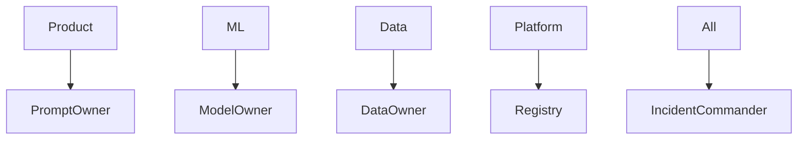

# Roles and Ownership

> RACI-style ownership for data, models, prompts, indexes, evals, and production incidents across ML, platform, and product teams.

## Table of Contents

- [Overview](#overview)
- [Definition](#definition)
- [Why It Matters](#why-it-matters)
- [Uses](#uses)
- [How It Works](#how-it-works)
- [Worked Example](#worked-example)
- [Python Examples](#python-examples)
- [Production Considerations](#production-considerations)
- [Performance Considerations](#performance-considerations)
- [Cost Considerations](#cost-considerations)
- [Security Considerations](#security-considerations)
- [Best Practices](#best-practices)
- [Common Mistakes](#common-mistakes)
- [Interview Preparation](#interview-preparation)
- [Navigation](#navigation)

---

## Overview

This lesson covers **Roles and Ownership** inside the `foundations` section of the `mlops-llmops` handbook. Treat it as production engineering guidance: clear definitions, when to apply the idea, system shape, and code you can adapt.

---

## Definition

**Roles and Ownership** — RACI-style ownership for data, models, prompts, indexes, evals, and production incidents across ML, platform, and product teams.

---

## Why It Matters

Orphan artifacts cause silent prod breaks. Clear owners make approvals, on-call, and rollbacks actually work.

Without a clear model for this topic, teams ship demos that fail under load, cost, or correctness pressure.

---

## Uses

| Use case | How this applies |
|----------|------------------|
| Model owner | Metrics, retrain cadence, rollback |
| Prompt owner | Template versions and eval |
| Data owner | Lineage, PII, refresh |
| Platform owner | Registry, pipelines, environments |

---

## How It Works

Every production artifact records `owner` and `deputy`. Incidents page the owner of the changed artifact first. Platform owns the rails; domain teams own contents.



---

## Worked Example

Index build fails Friday night: data owner paged; platform helps with pipeline; prompt owner stands by if retrieval shape changes.

---

## Python Examples

```python
from dataclasses import dataclass

@dataclass
class Ownership:
    artifact_id: str
    owner: str
    deputy: str
    oncall_schedule: str
    team: str

REGISTRY_OWNERS: dict[str, Ownership] = {}

def register(o: Ownership) -> None:
    if not o.owner or not o.deputy:
        raise ValueError("owner_and_deputy_required")
    REGISTRY_OWNERS[o.artifact_id] = o

def page_for(artifact_id: str, primary: bool = True) -> str:
    o = REGISTRY_OWNERS[artifact_id]
    return o.owner if primary else o.deputy

def raci_matrix() -> dict[str, dict[str, str]]:
    # R=responsible A=accountable C=consulted I=informed
    return {
        "prompt_change": {"product": "A", "ml": "C", "platform": "I", "data": "I"},
        "model_promote": {"ml": "A", "platform": "R", "product": "C", "data": "C"},
        "index_rebuild": {"data": "A", "platform": "R", "ml": "C", "product": "I"},
        "prod_incident": {"owner": "A", "platform": "R", "product": "C"},
    }

```

---

## Production Considerations

- Log request IDs across orchestration steps.
- Fail closed on auth and policy; degrade only where product explicitly allows it.
- Keep feature flags for prompt/model swaps.

## Performance Considerations

- Bound concurrency to the model provider.
- Stream when UX needs time-to-first-token.
- Cache stable sub-results carefully with invalidation rules.

## Cost Considerations

- Track tokens and tool calls per feature / tenant.
- Prefer smaller models for routers and classifiers.
- Cap max tokens and tool-loop iterations.

## Security Considerations

- Never put secrets in prompts.
- Treat model output as untrusted until validated.
- Enforce tenant isolation on retrieval and tools.

---

## Best Practices

1. Version models, prompts, datasets, and indexes as first-class artifacts.
2. Gate promotions on eval suites with explicit floors.
3. Track online drift and user feedback into curated datasets.
4. Keep environment parity for staging and prod serving.
5. Own rollback paths for every promoted change.

---

## Common Mistakes

- Shipping prompt changes without registry or eval.
- Training on leaking eval data.
- No owner for production model incidents.
- Indexes rebuilt silently without version pins.
- Feedback collected but never sampled into training/eval.

---

## Interview Preparation

**Q: How does LLMOps differ from classic MLOps?**

A: LLMOps adds prompts, traces, retrieval indexes, and judge/eval pipelines as versioned artifacts alongside models and datasets — with different drift and cost profiles.

**Q: What must be versioned for an LLM feature?**

A: Code, prompt templates, model/adapter ids, retrieval index build, tool schemas, and the eval suite that certified the release.

**Q: How do you roll back safely?**

A: Pin previous artifact bundle (model+prompt+index), flip traffic via registry stage, verify online metrics, and keep data plane compatible.

---

## Navigation

- **Section hub:** [README](README.md)
- **Topic hub:** [../README.md](../README.md)
