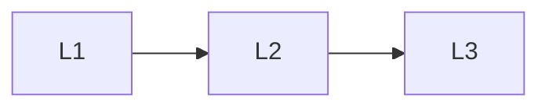

# Foundations

> Section of the **mlops-llmops** handbook.

## Lessons

| # | Lesson |
|---|--------|
| 1 | [MLOps vs LLMOps](01-mlops-vs-llmops.md) |
| 2 | [Lifecycle Overview](02-lifecycle-overview.md) |
| 3 | [Roles and Ownership](03-roles-and-ownership.md) |

**Topic hub:** [../README.md](../README.md)
