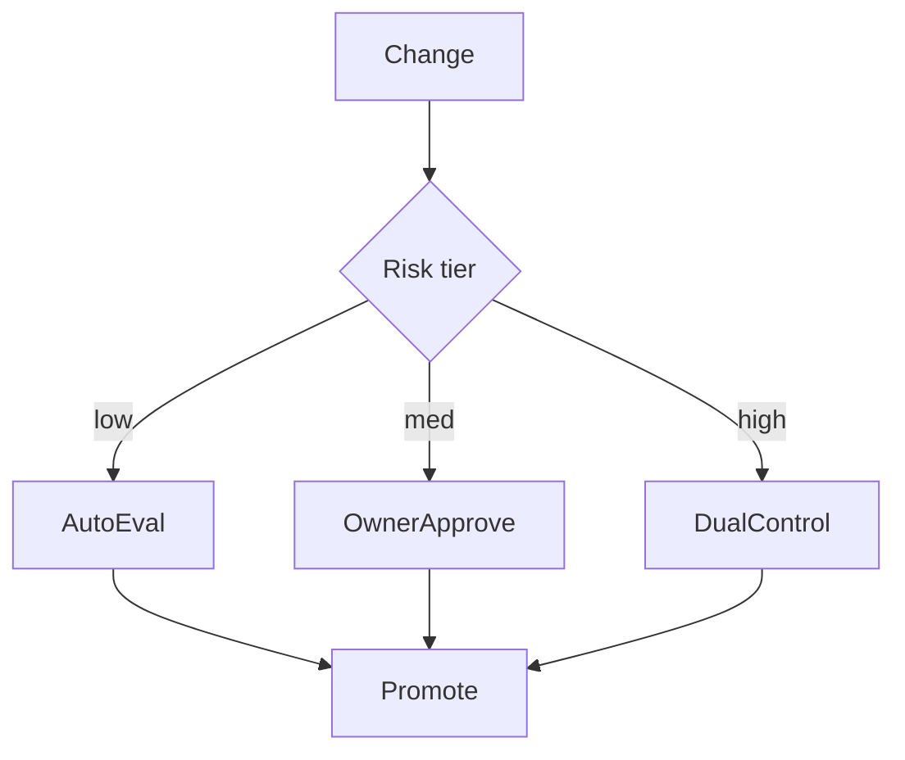

# Approvals

> Human and automated approval gates for promoting data, models, prompts, and indexes — including dual control for high-risk changes.

## Table of Contents

- [Overview](#overview)
- [Definition](#definition)
- [Why It Matters](#why-it-matters)
- [Uses](#uses)
- [How It Works](#how-it-works)
- [Worked Example](#worked-example)
- [Python Examples](#python-examples)
- [Production Considerations](#production-considerations)
- [Performance Considerations](#performance-considerations)
- [Cost Considerations](#cost-considerations)
- [Security Considerations](#security-considerations)
- [Best Practices](#best-practices)
- [Common Mistakes](#common-mistakes)
- [Interview Preparation](#interview-preparation)
- [Navigation](#navigation)

---

## Overview

This lesson covers **Approvals** inside the `governance` section of the `mlops-llmops` handbook. Treat it as production engineering guidance: clear definitions, when to apply the idea, system shape, and code you can adapt.

---

## Definition

**Approvals** — Human and automated approval gates for promoting data, models, prompts, and indexes — including dual control for high-risk changes.

---

## Why It Matters

Approvals encode organizational risk tolerance. Without them, anyone can change prod behavior with a prompt edit.

Without a clear model for this topic, teams ship demos that fail under load, cost, or correctness pressure.

---

## Uses

| Use case | How this applies |
|----------|------------------|
| Low risk | Automated eval gate only |
| Medium | Owner approve + eval |
| High | Dual control + security review |
| Emergency | Break-glass with post-hoc audit |

---

## How It Works

Bind risk tiers to artifact kinds and blast radius. Record approver identities. Time-limit approvals. Break-glass must page security and expire.



---

## Worked Example

Prod prompt change for medical advice path requires dual control; FAQ tone change is owner+eval only.

---

## Python Examples

```python
from dataclasses import dataclass
from time import time

@dataclass
class Approval:
    change_id: str
    tier: str
    approvers: list[str]
    needed: int
    expires: float
    evidence_eval: str

def risk_tier(kind: str, blast: str) -> str:
    if kind in {"model", "index"} and blast == "all_traffic":
        return "high"
    if kind == "prompt" and blast == "all_traffic":
        return "medium"
    return "low"

def needed_approvers(tier: str) -> int:
    return {"low": 0, "medium": 1, "high": 2}[tier]

def approve(a: Approval, user: str) -> bool:
    if time() > a.expires:
        return False
    if user not in a.approvers:
        a.approvers.append(user)
    return len(a.approvers) >= a.needed and bool(a.evidence_eval)

def break_glass(change_id: str, actor: str, ticket: str) -> dict:
    return {
        "change_id": change_id,
        "actor": actor,
        "ticket": ticket,
        "mode": "break_glass",
        "ts": time(),
    }

```

---

## Production Considerations

- Log request IDs across orchestration steps.
- Fail closed on auth and policy; degrade only where product explicitly allows it.
- Keep feature flags for prompt/model swaps.

## Performance Considerations

- Bound concurrency to the model provider.
- Stream when UX needs time-to-first-token.
- Cache stable sub-results carefully with invalidation rules.

## Cost Considerations

- Track tokens and tool calls per feature / tenant.
- Prefer smaller models for routers and classifiers.
- Cap max tokens and tool-loop iterations.

## Security Considerations

- Never put secrets in prompts.
- Treat model output as untrusted until validated.
- Enforce tenant isolation on retrieval and tools.

---

## Best Practices

1. Version models, prompts, datasets, and indexes as first-class artifacts.
2. Gate promotions on eval suites with explicit floors.
3. Track online drift and user feedback into curated datasets.
4. Keep environment parity for staging and prod serving.
5. Own rollback paths for every promoted change.

---

## Common Mistakes

- Shipping prompt changes without registry or eval.
- Training on leaking eval data.
- No owner for production model incidents.
- Indexes rebuilt silently without version pins.
- Feedback collected but never sampled into training/eval.

---

## Interview Preparation

**Q: How does LLMOps differ from classic MLOps?**

A: LLMOps adds prompts, traces, retrieval indexes, and judge/eval pipelines as versioned artifacts alongside models and datasets — with different drift and cost profiles.

**Q: What must be versioned for an LLM feature?**

A: Code, prompt templates, model/adapter ids, retrieval index build, tool schemas, and the eval suite that certified the release.

**Q: How do you roll back safely?**

A: Pin previous artifact bundle (model+prompt+index), flip traffic via registry stage, verify online metrics, and keep data plane compatible.

---

## Navigation

- **Section hub:** [README](README.md)
- **Topic hub:** [../README.md](../README.md)
