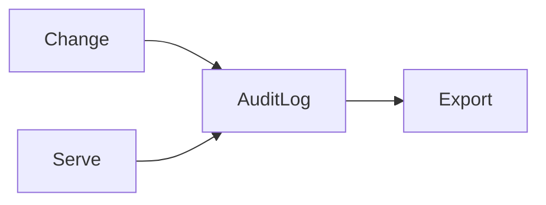

# Audit

> Immutable records of who changed which artifact, why, with what evidence, and what traffic saw — for compliance and debugging.

## Table of Contents

- [Overview](#overview)
- [Definition](#definition)
- [Why It Matters](#why-it-matters)
- [Uses](#uses)
- [How It Works](#how-it-works)
- [Worked Example](#worked-example)
- [Python Examples](#python-examples)
- [Production Considerations](#production-considerations)
- [Performance Considerations](#performance-considerations)
- [Cost Considerations](#cost-considerations)
- [Security Considerations](#security-considerations)
- [Best Practices](#best-practices)
- [Common Mistakes](#common-mistakes)
- [Interview Preparation](#interview-preparation)
- [Navigation](#navigation)

---

## Overview

This lesson covers **Audit** inside the `governance` section of the `mlops-llmops` handbook. Treat it as production engineering guidance: clear definitions, when to apply the idea, system shape, and code you can adapt.

---

## Definition

**Audit** — Immutable records of who changed which artifact, why, with what evidence, and what traffic saw — for compliance and debugging.

---

## Why It Matters

Audits turn he-said-she-said into facts. Regulated industries require them; everyone else needs them at 2am.

Without a clear model for this topic, teams ship demos that fail under load, cost, or correctness pressure.

---

## Uses

| Use case | How this applies |
|----------|------------------|
| Promote events | Actor, from→to version |
| Inference sample | Optional keyed logs |
| Access | Who read prod artifacts |
| Export | Compliance packages |

---

## How It Works

Append-only store with hash chaining when required. Redact secrets/PII. Retain per policy. Link audit entries to run ids and release bundles.



---

## Worked Example

Auditor asks which prompt answered customers on Aug 1; audit export shows alias history and approvers.

---

## Python Examples

```python
from dataclasses import dataclass, field
from hashlib import sha256
from time import time
from typing import Any
import json

@dataclass
class AuditRecord:
    ts: float
    actor: str
    action: str
    resource: str
    detail: dict[str, Any]
    prev_hash: str
    hash: str = ""

@dataclass
class AuditLog:
    records: list[AuditRecord] = field(default_factory=list)

    def append(self, actor: str, action: str, resource: str, detail: dict) -> AuditRecord:
        prev = self.records[-1].hash if self.records else "GENESIS"
        body = json.dumps({"actor": actor, "action": action, "resource": resource, "detail": detail, "prev": prev}, sort_keys=True)
        h = sha256(body.encode()).hexdigest()
        rec = AuditRecord(time(), actor, action, resource, detail, prev, h)
        self.records.append(rec)
        return rec

    def export(self, resource_prefix: str) -> list[dict]:
        return [r.__dict__ for r in self.records if r.resource.startswith(resource_prefix)]

```

---

## Production Considerations

- Log request IDs across orchestration steps.
- Fail closed on auth and policy; degrade only where product explicitly allows it.
- Keep feature flags for prompt/model swaps.

## Performance Considerations

- Bound concurrency to the model provider.
- Stream when UX needs time-to-first-token.
- Cache stable sub-results carefully with invalidation rules.

## Cost Considerations

- Track tokens and tool calls per feature / tenant.
- Prefer smaller models for routers and classifiers.
- Cap max tokens and tool-loop iterations.

## Security Considerations

- Never put secrets in prompts.
- Treat model output as untrusted until validated.
- Enforce tenant isolation on retrieval and tools.

---

## Best Practices

1. Version models, prompts, datasets, and indexes as first-class artifacts.
2. Gate promotions on eval suites with explicit floors.
3. Track online drift and user feedback into curated datasets.
4. Keep environment parity for staging and prod serving.
5. Own rollback paths for every promoted change.

---

## Common Mistakes

- Shipping prompt changes without registry or eval.
- Training on leaking eval data.
- No owner for production model incidents.
- Indexes rebuilt silently without version pins.
- Feedback collected but never sampled into training/eval.

---

## Interview Preparation

**Q: How does LLMOps differ from classic MLOps?**

A: LLMOps adds prompts, traces, retrieval indexes, and judge/eval pipelines as versioned artifacts alongside models and datasets — with different drift and cost profiles.

**Q: What must be versioned for an LLM feature?**

A: Code, prompt templates, model/adapter ids, retrieval index build, tool schemas, and the eval suite that certified the release.

**Q: How do you roll back safely?**

A: Pin previous artifact bundle (model+prompt+index), flip traffic via registry stage, verify online metrics, and keep data plane compatible.

---

## Navigation

- **Section hub:** [README](README.md)
- **Topic hub:** [../README.md](../README.md)
