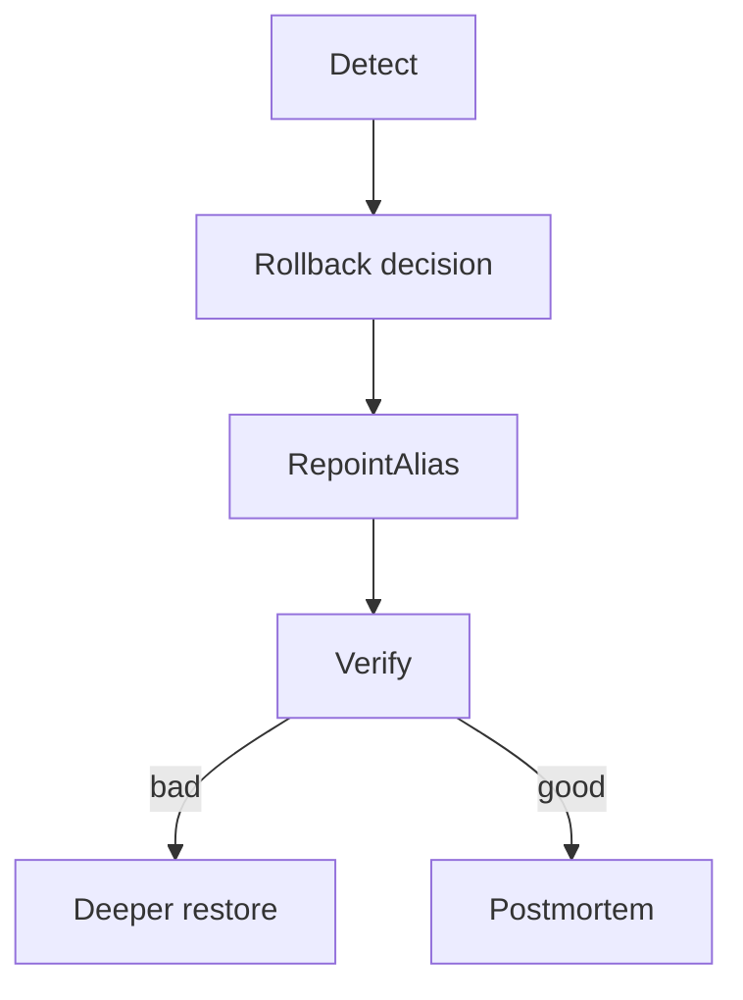

# Rollback

> Fast, tested procedures to revert model, prompt, index, or full bundles when quality, cost, or safety regresses.

## Table of Contents

- [Overview](#overview)
- [Definition](#definition)
- [Why It Matters](#why-it-matters)
- [Uses](#uses)
- [How It Works](#how-it-works)
- [Worked Example](#worked-example)
- [Python Examples](#python-examples)
- [Production Considerations](#production-considerations)
- [Performance Considerations](#performance-considerations)
- [Cost Considerations](#cost-considerations)
- [Security Considerations](#security-considerations)
- [Best Practices](#best-practices)
- [Common Mistakes](#common-mistakes)
- [Interview Preparation](#interview-preparation)
- [Navigation](#navigation)

---

## Overview

This lesson covers **Rollback** inside the `governance` section of the `mlops-llmops` handbook. Treat it as production engineering guidance: clear definitions, when to apply the idea, system shape, and code you can adapt.

---

## Definition

**Rollback** — Fast, tested procedures to revert model, prompt, index, or full bundles when quality, cost, or safety regresses.

---

## Why It Matters

Rollback is the last line of defense. If it is untested, it is cosplay. LLM systems need multi-artifact rollback, not only model files.

Without a clear model for this topic, teams ship demos that fail under load, cost, or correctness pressure.

---

## Uses

| Use case | How this applies |
|----------|------------------|
| Alias repoint | Seconds-level revert |
| Bundle restore | Model+prompt+index together |
| Partial | Prompt only if model fine |
| Data plane | Compat checks before revert |

---

## How It Works

Store previous alias targets. Rehearse rollback in staging monthly. Verify with smoke eval + online SLIs. Communicate to on-call and product.



---

## Worked Example

Quality proxy drops 12% after index promote; rollback alias to prior index in 2 minutes; prompt/model unchanged.

---

## Python Examples

```python
from dataclasses import dataclass, field
from time import time

@dataclass
class AliasHistory:
    alias: str
    versions: list[str] = field(default_factory=list)

    def promote(self, version: str) -> None:
        self.versions.append(version)

    def rollback(self) -> str:
        if len(self.versions) < 2:
            raise RuntimeError("no_previous_version")
        self.versions.pop()
        return self.versions[-1]

@dataclass
class RollbackResult:
    ok: bool
    restored: dict[str, str]
    verified: bool
    ts: float = field(default_factory=time)

def rollback_bundle(histories: dict[str, AliasHistory], smoke_ok) -> RollbackResult:
    restored = {}
    for name, hist in histories.items():
        restored[name] = hist.rollback()
    return RollbackResult(True, restored, bool(smoke_ok(restored)))

def smoke_check(restored: dict[str, str]) -> bool:
    return all(restored.values())

```

---

## Production Considerations

- Log request IDs across orchestration steps.
- Fail closed on auth and policy; degrade only where product explicitly allows it.
- Keep feature flags for prompt/model swaps.

## Performance Considerations

- Bound concurrency to the model provider.
- Stream when UX needs time-to-first-token.
- Cache stable sub-results carefully with invalidation rules.

## Cost Considerations

- Track tokens and tool calls per feature / tenant.
- Prefer smaller models for routers and classifiers.
- Cap max tokens and tool-loop iterations.

## Security Considerations

- Never put secrets in prompts.
- Treat model output as untrusted until validated.
- Enforce tenant isolation on retrieval and tools.

---

## Best Practices

1. Version models, prompts, datasets, and indexes as first-class artifacts.
2. Gate promotions on eval suites with explicit floors.
3. Track online drift and user feedback into curated datasets.
4. Keep environment parity for staging and prod serving.
5. Own rollback paths for every promoted change.

---

## Common Mistakes

- Shipping prompt changes without registry or eval.
- Training on leaking eval data.
- No owner for production model incidents.
- Indexes rebuilt silently without version pins.
- Feedback collected but never sampled into training/eval.

---

## Interview Preparation

**Q: How does LLMOps differ from classic MLOps?**

A: LLMOps adds prompts, traces, retrieval indexes, and judge/eval pipelines as versioned artifacts alongside models and datasets — with different drift and cost profiles.

**Q: What must be versioned for an LLM feature?**

A: Code, prompt templates, model/adapter ids, retrieval index build, tool schemas, and the eval suite that certified the release.

**Q: How do you roll back safely?**

A: Pin previous artifact bundle (model+prompt+index), flip traffic via registry stage, verify online metrics, and keep data plane compatible.

---

## Navigation

- **Section hub:** [README](README.md)
- **Topic hub:** [../README.md](../README.md)
