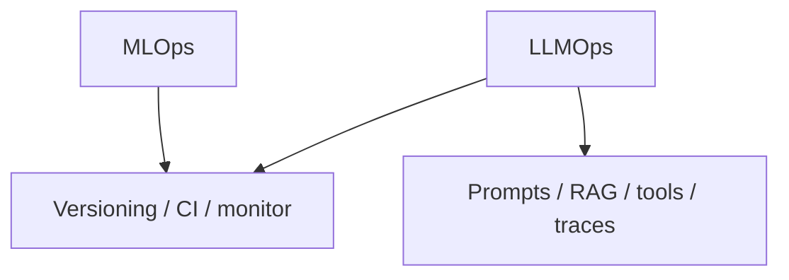

# MLOps vs LLMOps

> What carries over from MLOps — and what is new with LLMs.

## Definition

MLOps centers on datasets, features, model training, and drift. LLMOps still needs those ideas, but also prompt versioning, trace/eval of generations, RAG index freshness, tool authz, and cost/latency token economics.

## Why it matters

Teams that only do 'model deploy' miss prompt regressions and retrieval rot — the usual LLM failure modes.

## How it works

## Key principles

1. **Everything is an artifact** — Prompts too.
2. **Eval is the release gate** — Not vibe checks.
3. **Watch drift in docs & tools** — Not only data features.

## Common applications

| Application | Description |
|-------------|-------------|
| Classical models | sklearn/torch serve |
| RAG apps | Index + prompt releases |
| Agents | Tool contract versions |

## Common mistakes

- Deploying prompt changes with no CI eval
- No ownership for knowledge-base freshness

## Further reading

- [Artifact versioning](artifact-versioning.md)
- [AI Evaluation](../ai-evaluation/README.md)
