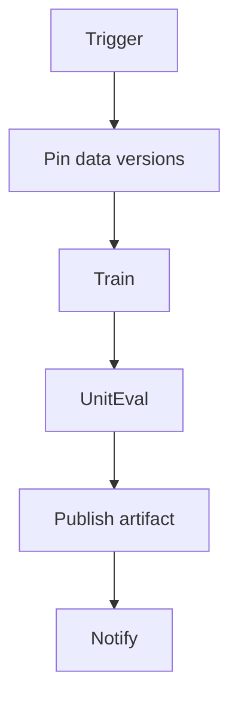

# Training and Fine-Tune CI

> Continuous integration for training/fine-tuning jobs: reproducible configs, data pins, tests, artifact publish, and failure notifications.

## Table of Contents

- [Overview](#overview)
- [Definition](#definition)
- [Why It Matters](#why-it-matters)
- [Uses](#uses)
- [How It Works](#how-it-works)
- [Worked Example](#worked-example)
- [Python Examples](#python-examples)
- [Production Considerations](#production-considerations)
- [Performance Considerations](#performance-considerations)
- [Cost Considerations](#cost-considerations)
- [Security Considerations](#security-considerations)
- [Best Practices](#best-practices)
- [Common Mistakes](#common-mistakes)
- [Interview Preparation](#interview-preparation)
- [Navigation](#navigation)

---

## Overview

This lesson covers **Training and Fine-Tune CI** inside the `pipelines` section of the `mlops-llmops` handbook. Treat it as production engineering guidance: clear definitions, when to apply the idea, system shape, and code you can adapt.

---

## Definition

**Training and Fine-Tune CI** — Continuous integration for training/fine-tuning jobs: reproducible configs, data pins, tests, artifact publish, and failure notifications.

---

## Why It Matters

Ad-hoc GPU jobs do not scale. CI turns fine-tunes into reviewable, repeatable unit-of-work with lineage.

Without a clear model for this topic, teams ship demos that fail under load, cost, or correctness pressure.

---

## Uses

| Use case | How this applies |
|----------|------------------|
| Nightly LoRA | Scheduled train on new labels |
| PR-triggered | Config change dry-run |
| Manual promote | Train → registry staging |
| Smoke | Overfit tiny batch in CI |

---

## How It Works

Pin container image, data versions, and base model. Fail job if eval floors miss. Upload metrics with artifact. Never auto-prod without a separate promote pipeline.



---

## Worked Example

Label batch lands; nightly FT CI trains LoRA, scores golden, publishes `adapter@sha` to staging only.

---

## Python Examples

```python
from dataclasses import dataclass

@dataclass
class TrainCIConfig:
    base_model: str
    data_version: str
    image: str
    lr: float
    epochs: int
    eval_floor: float

@dataclass
class TrainCIResult:
    ok: bool
    metrics: dict
    artifact_version: str | None
    reason: str = ""

def run_train_ci(cfg: TrainCIConfig, train_fn, eval_fn, publish_fn) -> TrainCIResult:
    assert cfg.data_version, "data pin required"
    assert cfg.image, "image pin required"
    metrics = {}
    train_fn(cfg)
    metrics = eval_fn(cfg)
    if metrics.get("score", 0) < cfg.eval_floor:
        return TrainCIResult(False, metrics, None, "eval_floor")
    ver = publish_fn(cfg, metrics)
    return TrainCIResult(True, metrics, ver)

def should_trigger(new_labels: int, min_labels: int = 200) -> bool:
    return new_labels >= min_labels

```

---

## Production Considerations

- Log request IDs across orchestration steps.
- Fail closed on auth and policy; degrade only where product explicitly allows it.
- Keep feature flags for prompt/model swaps.

## Performance Considerations

- Bound concurrency to the model provider.
- Stream when UX needs time-to-first-token.
- Cache stable sub-results carefully with invalidation rules.

## Cost Considerations

- Track tokens and tool calls per feature / tenant.
- Prefer smaller models for routers and classifiers.
- Cap max tokens and tool-loop iterations.

## Security Considerations

- Never put secrets in prompts.
- Treat model output as untrusted until validated.
- Enforce tenant isolation on retrieval and tools.

---

## Best Practices

1. Version models, prompts, datasets, and indexes as first-class artifacts.
2. Gate promotions on eval suites with explicit floors.
3. Track online drift and user feedback into curated datasets.
4. Keep environment parity for staging and prod serving.
5. Own rollback paths for every promoted change.

---

## Common Mistakes

- Shipping prompt changes without registry or eval.
- Training on leaking eval data.
- No owner for production model incidents.
- Indexes rebuilt silently without version pins.
- Feedback collected but never sampled into training/eval.

---

## Interview Preparation

**Q: How does LLMOps differ from classic MLOps?**

A: LLMOps adds prompts, traces, retrieval indexes, and judge/eval pipelines as versioned artifacts alongside models and datasets — with different drift and cost profiles.

**Q: What must be versioned for an LLM feature?**

A: Code, prompt templates, model/adapter ids, retrieval index build, tool schemas, and the eval suite that certified the release.

**Q: How do you roll back safely?**

A: Pin previous artifact bundle (model+prompt+index), flip traffic via registry stage, verify online metrics, and keep data plane compatible.

---

## Navigation

- **Section hub:** [README](README.md)
- **Topic hub:** [../README.md](../README.md)
