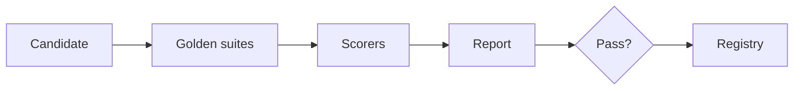

# Eval Pipelines

> Automated offline evaluation pipelines that score candidates (models, prompts, indexes) against golden suites and publish gate decisions.

## Table of Contents

- [Overview](#overview)
- [Definition](#definition)
- [Why It Matters](#why-it-matters)
- [Uses](#uses)
- [How It Works](#how-it-works)
- [Worked Example](#worked-example)
- [Python Examples](#python-examples)
- [Production Considerations](#production-considerations)
- [Performance Considerations](#performance-considerations)
- [Cost Considerations](#cost-considerations)
- [Security Considerations](#security-considerations)
- [Best Practices](#best-practices)
- [Common Mistakes](#common-mistakes)
- [Interview Preparation](#interview-preparation)
- [Navigation](#navigation)

---

## Overview

This lesson covers **Eval Pipelines** inside the `pipelines` section of the `mlops-llmops` handbook. Treat it as production engineering guidance: clear definitions, when to apply the idea, system shape, and code you can adapt.

---

## Definition

**Eval Pipelines** — Automated offline evaluation pipelines that score candidates (models, prompts, indexes) against golden suites and publish gate decisions.

---

## Why It Matters

Manual eval spreadsheets do not protect prod. Eval pipelines are the CI tests of LLM systems.

Without a clear model for this topic, teams ship demos that fail under load, cost, or correctness pressure.

---

## Uses

| Use case | How this applies |
|----------|------------------|
| PR checks | Prompt diff vs golden |
| Nightly | Regression across features |
| Release | Full suite + safety |
| Judge refresh | Calibrate LLM judges |

---

## How It Works

Version the suite itself. Run deterministic scorers first; LLM judges with anchors second. Store slice metrics. Block on any safety floor miss.



---

## Worked Example

Prompt PR fails groundedness 0.78 < 0.85 on finance slice — gate red, no staging promote.

---

## Python Examples

```python
from dataclasses import dataclass

@dataclass
class EvalCase:
    id: str
    input: dict
    expected: dict
    tags: list[str]

@dataclass
class GateResult:
    passed: bool
    metrics: dict[str, float]
    failed_slices: list[str]

def score_suite(cases: list[EvalCase], predict, metric_fn) -> dict[str, float]:
    scores = []
    by_tag: dict[str, list[float]] = {}
    for c in cases:
        pred = predict(c.input)
        s = metric_fn(pred, c.expected)
        scores.append(s)
        for t in c.tags:
            by_tag.setdefault(t, []).append(s)
    out = {"overall": sum(scores) / max(1, len(scores))}
    for t, xs in by_tag.items():
        out[f"slice:{t}"] = sum(xs) / len(xs)
    return out

def apply_gates(metrics: dict[str, float], floors: dict[str, float]) -> GateResult:
    failed = [k for k, floor in floors.items() if metrics.get(k, 0) < floor]
    return GateResult(not failed, metrics, failed)

```

---

## Production Considerations

- Log request IDs across orchestration steps.
- Fail closed on auth and policy; degrade only where product explicitly allows it.
- Keep feature flags for prompt/model swaps.

## Performance Considerations

- Bound concurrency to the model provider.
- Stream when UX needs time-to-first-token.
- Cache stable sub-results carefully with invalidation rules.

## Cost Considerations

- Track tokens and tool calls per feature / tenant.
- Prefer smaller models for routers and classifiers.
- Cap max tokens and tool-loop iterations.

## Security Considerations

- Never put secrets in prompts.
- Treat model output as untrusted until validated.
- Enforce tenant isolation on retrieval and tools.

---

## Best Practices

1. Version models, prompts, datasets, and indexes as first-class artifacts.
2. Gate promotions on eval suites with explicit floors.
3. Track online drift and user feedback into curated datasets.
4. Keep environment parity for staging and prod serving.
5. Own rollback paths for every promoted change.

---

## Common Mistakes

- Shipping prompt changes without registry or eval.
- Training on leaking eval data.
- No owner for production model incidents.
- Indexes rebuilt silently without version pins.
- Feedback collected but never sampled into training/eval.

---

## Interview Preparation

**Q: How does LLMOps differ from classic MLOps?**

A: LLMOps adds prompts, traces, retrieval indexes, and judge/eval pipelines as versioned artifacts alongside models and datasets — with different drift and cost profiles.

**Q: What must be versioned for an LLM feature?**

A: Code, prompt templates, model/adapter ids, retrieval index build, tool schemas, and the eval suite that certified the release.

**Q: How do you roll back safely?**

A: Pin previous artifact bundle (model+prompt+index), flip traffic via registry stage, verify online metrics, and keep data plane compatible.

---

## Navigation

- **Section hub:** [README](README.md)
- **Topic hub:** [../README.md](../README.md)
