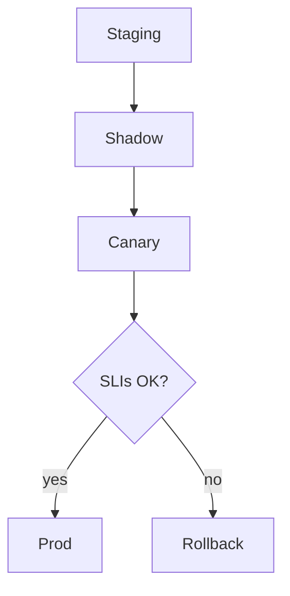

# Deploy Pipelines

> Promotion pipelines from staging to production: canaries, shadow traffic, health checks, and automated rollback hooks for ML/LLM artifacts.

## Table of Contents

- [Overview](#overview)
- [Definition](#definition)
- [Why It Matters](#why-it-matters)
- [Uses](#uses)
- [How It Works](#how-it-works)
- [Worked Example](#worked-example)
- [Python Examples](#python-examples)
- [Production Considerations](#production-considerations)
- [Performance Considerations](#performance-considerations)
- [Cost Considerations](#cost-considerations)
- [Security Considerations](#security-considerations)
- [Best Practices](#best-practices)
- [Common Mistakes](#common-mistakes)
- [Interview Preparation](#interview-preparation)
- [Navigation](#navigation)

---

## Overview

This lesson covers **Deploy Pipelines** inside the `pipelines` section of the `mlops-llmops` handbook. Treat it as production engineering guidance: clear definitions, when to apply the idea, system shape, and code you can adapt.

---

## Definition

**Deploy Pipelines** — Promotion pipelines from staging to production: canaries, shadow traffic, health checks, and automated rollback hooks for ML/LLM artifacts.

---

## Why It Matters

Deploy is where users meet your registry. Pipelines make promotion deliberate and reversible.

Without a clear model for this topic, teams ship demos that fail under load, cost, or correctness pressure.

---

## Uses

| Use case | How this applies |
|----------|------------------|
| Canary | 5% traffic on new bundle |
| Shadow | Score new prompt offline on live inputs |
| Blue/green | Index swap with instant revert |
| Feature flag | Bundle selection per tenant |

---

## How It Works

Deploy the *bundle* (model+prompt+index). Watch cost and quality SLIs, not only latency. Auto-rollback on hard faults; human confirm on soft quality dips if desired.



---

## Worked Example

Canary shows token cost +35% with flat quality — auto-rollback to prior bundle within 10 minutes.

---

## Python Examples

```python
from dataclasses import dataclass

@dataclass
class DeployState:
    bundle: str
    stage: str  # staging|shadow|canary|prod
    traffic: float

@dataclass
class SLI:
    error_rate: float
    p95_ms: float
    usd_per_1k: float
    quality_proxy: float

def health_ok(s: SLI, floors: dict) -> bool:
    return (
        s.error_rate <= floors["error_rate"]
        and s.p95_ms <= floors["p95_ms"]
        and s.usd_per_1k <= floors["usd_per_1k"]
        and s.quality_proxy >= floors["quality_proxy"]
    )

def next_deploy(state: DeployState, sli: SLI, floors: dict) -> DeployState:
    if not health_ok(sli, floors):
        return DeployState(state.bundle, "rollback", 0.0)
    order = ["staging", "shadow", "canary", "prod"]
    traffic = {"staging": 0.0, "shadow": 0.0, "canary": 0.05, "prod": 1.0}
    i = order.index(state.stage)
    if i + 1 < len(order):
        ns = order[i + 1]
        return DeployState(state.bundle, ns, traffic[ns])
    return state

```

---

## Production Considerations

- Log request IDs across orchestration steps.
- Fail closed on auth and policy; degrade only where product explicitly allows it.
- Keep feature flags for prompt/model swaps.

## Performance Considerations

- Bound concurrency to the model provider.
- Stream when UX needs time-to-first-token.
- Cache stable sub-results carefully with invalidation rules.

## Cost Considerations

- Track tokens and tool calls per feature / tenant.
- Prefer smaller models for routers and classifiers.
- Cap max tokens and tool-loop iterations.

## Security Considerations

- Never put secrets in prompts.
- Treat model output as untrusted until validated.
- Enforce tenant isolation on retrieval and tools.

---

## Best Practices

1. Version models, prompts, datasets, and indexes as first-class artifacts.
2. Gate promotions on eval suites with explicit floors.
3. Track online drift and user feedback into curated datasets.
4. Keep environment parity for staging and prod serving.
5. Own rollback paths for every promoted change.

---

## Common Mistakes

- Shipping prompt changes without registry or eval.
- Training on leaking eval data.
- No owner for production model incidents.
- Indexes rebuilt silently without version pins.
- Feedback collected but never sampled into training/eval.

---

## Interview Preparation

**Q: How does LLMOps differ from classic MLOps?**

A: LLMOps adds prompts, traces, retrieval indexes, and judge/eval pipelines as versioned artifacts alongside models and datasets — with different drift and cost profiles.

**Q: What must be versioned for an LLM feature?**

A: Code, prompt templates, model/adapter ids, retrieval index build, tool schemas, and the eval suite that certified the release.

**Q: How do you roll back safely?**

A: Pin previous artifact bundle (model+prompt+index), flip traffic via registry stage, verify online metrics, and keep data plane compatible.

---

## Navigation

- **Section hub:** [README](README.md)
- **Topic hub:** [../README.md](../README.md)
