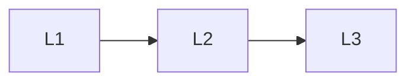

# Pipelines

> Section of the **mlops-llmops** handbook.

## Lessons

| # | Lesson |
|---|--------|
| 1 | [Training and Fine-Tune CI](01-training-and-ft-ci.md) |
| 2 | [Eval Pipelines](02-eval-pipelines.md) |
| 3 | [Deploy Pipelines](03-deploy-pipelines.md) |

**Topic hub:** [../README.md](../README.md)
