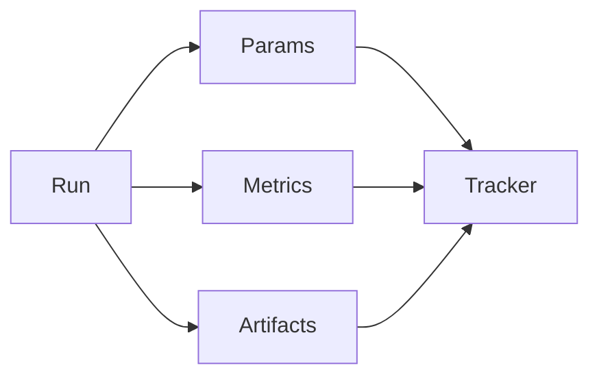

# Experiment Tracking

> Logging parameters, metrics, artifacts, and lineage for ML/LLM experiments so results are comparable and reproducible.

## Table of Contents

- [Overview](#overview)
- [Definition](#definition)
- [Why It Matters](#why-it-matters)
- [Uses](#uses)
- [How It Works](#how-it-works)
- [Worked Example](#worked-example)
- [Python Examples](#python-examples)
- [Production Considerations](#production-considerations)
- [Performance Considerations](#performance-considerations)
- [Cost Considerations](#cost-considerations)
- [Security Considerations](#security-considerations)
- [Best Practices](#best-practices)
- [Common Mistakes](#common-mistakes)
- [Interview Preparation](#interview-preparation)
- [Navigation](#navigation)

---

## Overview

This lesson covers **Experiment Tracking** inside the `platform` section of the `mlops-llmops` handbook. Treat it as production engineering guidance: clear definitions, when to apply the idea, system shape, and code you can adapt.

---

## Definition

**Experiment Tracking** — Logging parameters, metrics, artifacts, and lineage for ML/LLM experiments so results are comparable and reproducible.

---

## Why It Matters

Undocumented experiments waste GPU and hide winners. Tracking is how teams learn across weeks and people.

Without a clear model for this topic, teams ship demos that fail under load, cost, or correctness pressure.

---

## Uses

| Use case | How this applies |
|----------|------------------|
| Training runs | Hyperparams + metrics |
| Prompt sweeps | Template variants |
| RAG ablations | Chunk/embedder trials |
| Judge studies | Agreement rates |

---

## How It Works

One run id ties params, metrics, and artifact versions. Compare runs on the same eval suite version. Tag failed runs too — negatives teach.



---

## Worked Example

Prompt sweep 24 variants tracked; winner `p17` linked to eval report and promoted via registry.

---

## Python Examples

```python
from dataclasses import dataclass, field
from time import time
from typing import Any
import uuid

@dataclass
class ExperimentRun:
    id: str
    name: str
    params: dict[str, Any]
    metrics: dict[str, float] = field(default_factory=dict)
    artifacts: dict[str, str] = field(default_factory=dict)
    tags: list[str] = field(default_factory=list)
    ts: float = field(default_factory=time)

class Tracker:
    def __init__(self):
        self.runs: dict[str, ExperimentRun] = {}

    def start(self, name: str, params: dict, tags: list[str] | None = None) -> ExperimentRun:
        r = ExperimentRun(str(uuid.uuid4()), name, params, tags=tags or [])
        self.runs[r.id] = r
        return r

    def log_metrics(self, run_id: str, **metrics: float) -> None:
        self.runs[run_id].metrics.update(metrics)

    def log_artifact(self, run_id: str, key: str, version: str) -> None:
        self.runs[run_id].artifacts[key] = version

    def best(self, name: str, metric: str) -> ExperimentRun | None:
        cands = [r for r in self.runs.values() if r.name == name and metric in r.metrics]
        return max(cands, key=lambda r: r.metrics[metric]) if cands else None

```

---

## Production Considerations

- Log request IDs across orchestration steps.
- Fail closed on auth and policy; degrade only where product explicitly allows it.
- Keep feature flags for prompt/model swaps.

## Performance Considerations

- Bound concurrency to the model provider.
- Stream when UX needs time-to-first-token.
- Cache stable sub-results carefully with invalidation rules.

## Cost Considerations

- Track tokens and tool calls per feature / tenant.
- Prefer smaller models for routers and classifiers.
- Cap max tokens and tool-loop iterations.

## Security Considerations

- Never put secrets in prompts.
- Treat model output as untrusted until validated.
- Enforce tenant isolation on retrieval and tools.

---

## Best Practices

1. Version models, prompts, datasets, and indexes as first-class artifacts.
2. Gate promotions on eval suites with explicit floors.
3. Track online drift and user feedback into curated datasets.
4. Keep environment parity for staging and prod serving.
5. Own rollback paths for every promoted change.

---

## Common Mistakes

- Shipping prompt changes without registry or eval.
- Training on leaking eval data.
- No owner for production model incidents.
- Indexes rebuilt silently without version pins.
- Feedback collected but never sampled into training/eval.

---

## Interview Preparation

**Q: How does LLMOps differ from classic MLOps?**

A: LLMOps adds prompts, traces, retrieval indexes, and judge/eval pipelines as versioned artifacts alongside models and datasets — with different drift and cost profiles.

**Q: What must be versioned for an LLM feature?**

A: Code, prompt templates, model/adapter ids, retrieval index build, tool schemas, and the eval suite that certified the release.

**Q: How do you roll back safely?**

A: Pin previous artifact bundle (model+prompt+index), flip traffic via registry stage, verify online metrics, and keep data plane compatible.

---

## Navigation

- **Section hub:** [README](README.md)
- **Topic hub:** [../README.md](../README.md)
