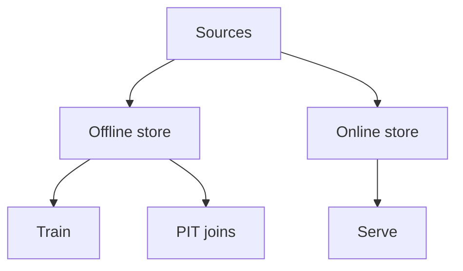

# Feature Stores (Light)

> A pragmatic view of feature stores for ML and light context stores for LLM apps — point-in-time correctness, reuse, and when *not* to build one.

## Table of Contents

- [Overview](#overview)
- [Definition](#definition)
- [Why It Matters](#why-it-matters)
- [Uses](#uses)
- [How It Works](#how-it-works)
- [Worked Example](#worked-example)
- [Python Examples](#python-examples)
- [Production Considerations](#production-considerations)
- [Performance Considerations](#performance-considerations)
- [Cost Considerations](#cost-considerations)
- [Security Considerations](#security-considerations)
- [Best Practices](#best-practices)
- [Common Mistakes](#common-mistakes)
- [Interview Preparation](#interview-preparation)
- [Navigation](#navigation)

---

## Overview

This lesson covers **Feature Stores (Light)** inside the `platform` section of the `mlops-llmops` handbook. Treat it as production engineering guidance: clear definitions, when to apply the idea, system shape, and code you can adapt.

---

## Definition

**Feature Stores (Light)** — A pragmatic view of feature stores for ML and light context stores for LLM apps — point-in-time correctness, reuse, and when *not* to build one.

---

## Why It Matters

Feature stores pay off with many models sharing signals. LLM apps often need entity context stores more than full offline/online feature platforms — choose deliberately.

Without a clear model for this topic, teams ship demos that fail under load, cost, or correctness pressure.

---

## Uses

| Use case | How this applies |
|----------|------------------|
| Classic ML | Shared numeric/categorical features |
| LLM context | Customer profile snippets with TTL |
| Fraud | Online features with low latency |
| Skip | Single model, few features |

---

## How It Works

Enforce point-in-time joins for training. Document feature owners and SLAs. For LLM, prefer explicit context APIs over stuffing a heavy feature platform prematurely.



---

## Worked Example

Churn model shares `logins_7d` with upsell model via store; LLM agent fetches `plan_name` + `last_tickets` via context API instead.

---

## Python Examples

```python
from dataclasses import dataclass
from time import time
from typing import Any

@dataclass
class FeatureValue:
    name: str
    value: Any
    event_ts: float
    written_ts: float

class LightFeatureStore:
    def __init__(self):
        self.online: dict[tuple[str, str], FeatureValue] = {}

    def put(self, entity_id: str, name: str, value: Any, event_ts: float) -> None:
        self.online[(entity_id, name)] = FeatureValue(name, value, event_ts, time())

    def get(self, entity_id: str, name: str) -> Any:
        fv = self.online.get((entity_id, name))
        return None if fv is None else fv.value

    def pit_get(self, entity_id: str, name: str, as_of: float) -> Any:
        fv = self.online.get((entity_id, name))
        if fv is None or fv.event_ts > as_of:
            return None
        return fv.value

def need_feature_store(n_models: int, n_shared_features: int) -> bool:
    return n_models >= 3 and n_shared_features >= 10

```

---

## Production Considerations

- Log request IDs across orchestration steps.
- Fail closed on auth and policy; degrade only where product explicitly allows it.
- Keep feature flags for prompt/model swaps.

## Performance Considerations

- Bound concurrency to the model provider.
- Stream when UX needs time-to-first-token.
- Cache stable sub-results carefully with invalidation rules.

## Cost Considerations

- Track tokens and tool calls per feature / tenant.
- Prefer smaller models for routers and classifiers.
- Cap max tokens and tool-loop iterations.

## Security Considerations

- Never put secrets in prompts.
- Treat model output as untrusted until validated.
- Enforce tenant isolation on retrieval and tools.

---

## Best Practices

1. Version models, prompts, datasets, and indexes as first-class artifacts.
2. Gate promotions on eval suites with explicit floors.
3. Track online drift and user feedback into curated datasets.
4. Keep environment parity for staging and prod serving.
5. Own rollback paths for every promoted change.

---

## Common Mistakes

- Shipping prompt changes without registry or eval.
- Training on leaking eval data.
- No owner for production model incidents.
- Indexes rebuilt silently without version pins.
- Feedback collected but never sampled into training/eval.

---

## Interview Preparation

**Q: How does LLMOps differ from classic MLOps?**

A: LLMOps adds prompts, traces, retrieval indexes, and judge/eval pipelines as versioned artifacts alongside models and datasets — with different drift and cost profiles.

**Q: What must be versioned for an LLM feature?**

A: Code, prompt templates, model/adapter ids, retrieval index build, tool schemas, and the eval suite that certified the release.

**Q: How do you roll back safely?**

A: Pin previous artifact bundle (model+prompt+index), flip traffic via registry stage, verify online metrics, and keep data plane compatible.

---

## Navigation

- **Section hub:** [README](README.md)
- **Topic hub:** [../README.md](../README.md)
