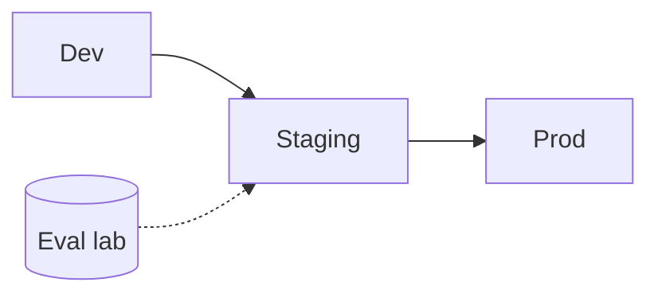

# Environments

> Dev, staging, and production environments for ML/LLM systems — data isolation, secret scopes, parity, and promotion rules.

## Table of Contents

- [Overview](#overview)
- [Definition](#definition)
- [Why It Matters](#why-it-matters)
- [Uses](#uses)
- [How It Works](#how-it-works)
- [Worked Example](#worked-example)
- [Python Examples](#python-examples)
- [Production Considerations](#production-considerations)
- [Performance Considerations](#performance-considerations)
- [Cost Considerations](#cost-considerations)
- [Security Considerations](#security-considerations)
- [Best Practices](#best-practices)
- [Common Mistakes](#common-mistakes)
- [Interview Preparation](#interview-preparation)
- [Navigation](#navigation)

---

## Overview

This lesson covers **Environments** inside the `platform` section of the `mlops-llmops` handbook. Treat it as production engineering guidance: clear definitions, when to apply the idea, system shape, and code you can adapt.

---

## Definition

**Environments** — Dev, staging, and production environments for ML/LLM systems — data isolation, secret scopes, parity, and promotion rules.

---

## Why It Matters

Environment chaos causes 'works in notebook' failures. Parity and isolation keep experiments from contaminating prod data and secrets.

Without a clear model for this topic, teams ship demos that fail under load, cost, or correctness pressure.

---

## Uses

| Use case | How this applies |
|----------|------------------|
| Dev | Synthetic or scrubbed data |
| Staging | Prod-like models with masked PII |
| Prod | Strict secrets and aliases |
| Eval lab | Frozen suites isolated |

---

## How It Works

Separate cloud accounts or projects when possible. Block prod credentials in dev. Replay prod traffic into staging carefully with redaction. Promote artifacts, not ad-hoc configs.



---

## Worked Example

Engineer cannot read prod prompt alias credentials from dev laptop — promote via CI role only.

---

## Python Examples

```python
from dataclasses import dataclass
from enum import Enum

class Env(Enum):
    DEV = "dev"
    STAGING = "staging"
    PROD = "prod"
    EVAL = "eval"

@dataclass
class EnvPolicy:
    env: Env
    allow_prod_secrets: bool
    allow_raw_pii: bool
    data_source: str

POLICIES = {
    Env.DEV: EnvPolicy(Env.DEV, False, False, "synthetic"),
    Env.STAGING: EnvPolicy(Env.STAGING, False, False, "masked_prod_sample"),
    Env.PROD: EnvPolicy(Env.PROD, True, True, "prod"),
    Env.EVAL: EnvPolicy(Env.EVAL, False, False, "golden_frozen"),
}

def may_use_secret(env: Env, secret_scope: str) -> bool:
    pol = POLICIES[env]
    if secret_scope == "prod" and not pol.allow_prod_secrets:
        return False
    return True

def promote_allowed(from_env: Env, to_env: Env) -> bool:
    order = [Env.DEV, Env.STAGING, Env.PROD]
    if from_env not in order or to_env not in order:
        return False
    return order.index(to_env) == order.index(from_env) + 1

```

---

## Production Considerations

- Log request IDs across orchestration steps.
- Fail closed on auth and policy; degrade only where product explicitly allows it.
- Keep feature flags for prompt/model swaps.

## Performance Considerations

- Bound concurrency to the model provider.
- Stream when UX needs time-to-first-token.
- Cache stable sub-results carefully with invalidation rules.

## Cost Considerations

- Track tokens and tool calls per feature / tenant.
- Prefer smaller models for routers and classifiers.
- Cap max tokens and tool-loop iterations.

## Security Considerations

- Never put secrets in prompts.
- Treat model output as untrusted until validated.
- Enforce tenant isolation on retrieval and tools.

---

## Best Practices

1. Version models, prompts, datasets, and indexes as first-class artifacts.
2. Gate promotions on eval suites with explicit floors.
3. Track online drift and user feedback into curated datasets.
4. Keep environment parity for staging and prod serving.
5. Own rollback paths for every promoted change.

---

## Common Mistakes

- Shipping prompt changes without registry or eval.
- Training on leaking eval data.
- No owner for production model incidents.
- Indexes rebuilt silently without version pins.
- Feedback collected but never sampled into training/eval.

---

## Interview Preparation

**Q: How does LLMOps differ from classic MLOps?**

A: LLMOps adds prompts, traces, retrieval indexes, and judge/eval pipelines as versioned artifacts alongside models and datasets — with different drift and cost profiles.

**Q: What must be versioned for an LLM feature?**

A: Code, prompt templates, model/adapter ids, retrieval index build, tool schemas, and the eval suite that certified the release.

**Q: How do you roll back safely?**

A: Pin previous artifact bundle (model+prompt+index), flip traffic via registry stage, verify online metrics, and keep data plane compatible.

---

## Navigation

- **Section hub:** [README](README.md)
- **Topic hub:** [../README.md](../README.md)
