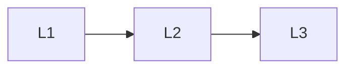

# Platform

> Section of the **mlops-llmops** handbook.

## Lessons

| # | Lesson |
|---|--------|
| 1 | [Experiment Tracking](01-experiment-tracking.md) |
| 2 | [Feature Stores (Light)](02-feature-stores-light.md) |
| 3 | [Environments](03-environments.md) |

**Topic hub:** [../README.md](../README.md)
