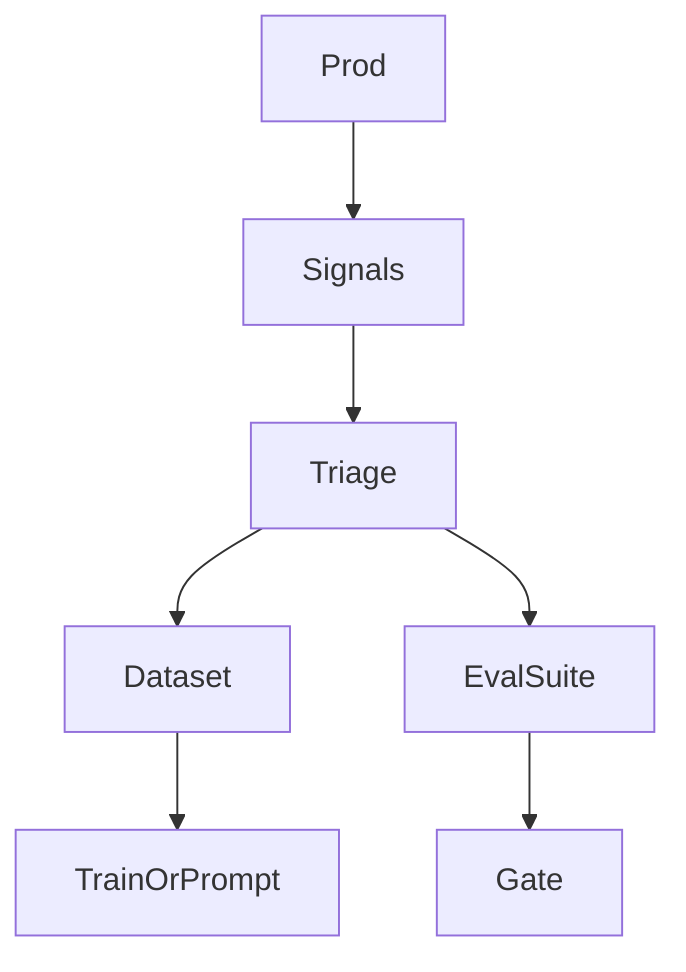

# Feedback Loops

> Closing the loop from production signals (thumbs, edits, outcomes, traces) back into datasets, evals, and improvement work — without poisoning training.

## Table of Contents

- [Overview](#overview)
- [Definition](#definition)
- [Why It Matters](#why-it-matters)
- [Uses](#uses)
- [How It Works](#how-it-works)
- [Worked Example](#worked-example)
- [Python Examples](#python-examples)
- [Production Considerations](#production-considerations)
- [Performance Considerations](#performance-considerations)
- [Cost Considerations](#cost-considerations)
- [Security Considerations](#security-considerations)
- [Best Practices](#best-practices)
- [Common Mistakes](#common-mistakes)
- [Interview Preparation](#interview-preparation)
- [Navigation](#navigation)

---

## Overview

This lesson covers **Feedback Loops** inside the `runtime-ops` section of the `mlops-llmops` handbook. Treat it as production engineering guidance: clear definitions, when to apply the idea, system shape, and code you can adapt.

---

## Definition

**Feedback Loops** — Closing the loop from production signals (thumbs, edits, outcomes, traces) back into datasets, evals, and improvement work — without poisoning training.

---

## Why It Matters

Open-loop systems rot. Feedback loops are how LLM products learn, but naive 'train on all logs' amplifies bias and leakage.

Without a clear model for this topic, teams ship demos that fail under load, cost, or correctness pressure.

---

## Uses

| Use case | How this applies |
|----------|------------------|
| Thumbs-down mining | Cluster failures → golden cases |
| Human edits | Preferred answers for DPO/SFT |
| Business outcomes | Ticket resolved / refund correct |
| Trace review | Weekly sample for policy breaks |

---

## How It Works

Sample and label; do not dump raw logs into train. Dedupe against golden sets. Route safety issues to policy owners first. Measure loop latency (signal→fix).



---

## Worked Example

Thumbs-down spike on refunds → 40 new golden cases → prompt fix certified same week; SFT batch queued monthly.

---

## Python Examples

```python
from dataclasses import dataclass, field
from collections import Counter

@dataclass
class FeedbackEvent:
    run_id: str
    kind: str  # thumb|edit|outcome|trace_flag
    payload: dict
    tenant: str

@dataclass
class FeedbackLoop:
    events: list[FeedbackEvent] = field(default_factory=list)
    queued_labels: list[dict] = field(default_factory=list)

    def ingest(self, ev: FeedbackEvent) -> None:
        self.events.append(ev)
        if ev.kind in {"thumb", "edit"} and ev.payload.get("negative"):
            self.queued_labels.append({
                "run_id": ev.run_id,
                "reason": ev.payload.get("reason"),
                "tenant": ev.tenant,
            })

    def cluster_reasons(self) -> Counter:
        return Counter(q.get("reason", "unknown") for q in self.queued_labels)

def promote_to_golden(queued: list[dict], reviewed: list[dict], max_n: int = 50) -> list[dict]:
    # reviewed items include labels from humans
    out = [r for r in reviewed if r.get("add_to_golden")]
    return out[:max_n]

def loop_sla_met(signal_to_fix_days: float, target: float = 14.0) -> bool:
    return signal_to_fix_days <= target

```

---

## Production Considerations

- Log request IDs across orchestration steps.
- Fail closed on auth and policy; degrade only where product explicitly allows it.
- Keep feature flags for prompt/model swaps.

## Performance Considerations

- Bound concurrency to the model provider.
- Stream when UX needs time-to-first-token.
- Cache stable sub-results carefully with invalidation rules.

## Cost Considerations

- Track tokens and tool calls per feature / tenant.
- Prefer smaller models for routers and classifiers.
- Cap max tokens and tool-loop iterations.

## Security Considerations

- Never put secrets in prompts.
- Treat model output as untrusted until validated.
- Enforce tenant isolation on retrieval and tools.

---

## Best Practices

1. Version models, prompts, datasets, and indexes as first-class artifacts.
2. Gate promotions on eval suites with explicit floors.
3. Track online drift and user feedback into curated datasets.
4. Keep environment parity for staging and prod serving.
5. Own rollback paths for every promoted change.

---

## Common Mistakes

- Shipping prompt changes without registry or eval.
- Training on leaking eval data.
- No owner for production model incidents.
- Indexes rebuilt silently without version pins.
- Feedback collected but never sampled into training/eval.

---

## Interview Preparation

**Q: How does LLMOps differ from classic MLOps?**

A: LLMOps adds prompts, traces, retrieval indexes, and judge/eval pipelines as versioned artifacts alongside models and datasets — with different drift and cost profiles.

**Q: What must be versioned for an LLM feature?**

A: Code, prompt templates, model/adapter ids, retrieval index build, tool schemas, and the eval suite that certified the release.

**Q: How do you roll back safely?**

A: Pin previous artifact bundle (model+prompt+index), flip traffic via registry stage, verify online metrics, and keep data plane compatible.

---

## Navigation

- **Section hub:** [README](README.md)
- **Topic hub:** [../README.md](../README.md)
