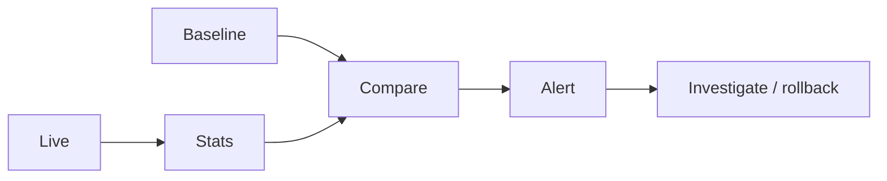

# Drift Detection

> Detecting data, embedding, prompt-behavior, and concept drift in ML/LLM systems with alerts that trigger investigation or rollback.

## Table of Contents

- [Overview](#overview)
- [Definition](#definition)
- [Why It Matters](#why-it-matters)
- [Uses](#uses)
- [How It Works](#how-it-works)
- [Worked Example](#worked-example)
- [Python Examples](#python-examples)
- [Production Considerations](#production-considerations)
- [Performance Considerations](#performance-considerations)
- [Cost Considerations](#cost-considerations)
- [Security Considerations](#security-considerations)
- [Best Practices](#best-practices)
- [Common Mistakes](#common-mistakes)
- [Interview Preparation](#interview-preparation)
- [Navigation](#navigation)

---

## Overview

This lesson covers **Drift Detection** inside the `runtime-ops` section of the `mlops-llmops` handbook. Treat it as production engineering guidance: clear definitions, when to apply the idea, system shape, and code you can adapt.

---

## Definition

**Drift Detection** — Detecting data, embedding, prompt-behavior, and concept drift in ML/LLM systems with alerts that trigger investigation or rollback.

---

## Why It Matters

Drift is how yesterday's green eval becomes today's silent failure. Detection must cover inputs, retrieval, and output distributions — not only classic feature stats.

Without a clear model for this topic, teams ship demos that fail under load, cost, or correctness pressure.

---

## Uses

| Use case | How this applies |
|----------|------------------|
| Input drift | New languages/intents |
| Embedding drift | Doc corpus shift |
| Output drift | Length, refusal, schema fail rates |
| Outcome drift | Business KPI moves |

---

## How It Works

Define baselines from certified windows. Track cheap proxies continuously; deep eval on schedule. Tie alerts to owners and playbooks.



---

## Worked Example

Schema-fail rate 0.5%→4% after provider change — drift alert → rollback model pin.

---

## Python Examples

```python
from dataclasses import dataclass
import math

@dataclass
class DriftMetric:
    name: str
    baseline: float
    live: float
    threshold: float

def relative_drift(baseline: float, live: float) -> float:
    if baseline == 0:
        return 0.0 if live == 0 else 1.0
    return abs(live - baseline) / abs(baseline)

def psi(expected: list[float], actual: list[float], eps: float = 1e-6) -> float:
    # Population Stability Index for binned probs
    return sum((e - a) * math.log((e + eps) / (a + eps)) for e, a in zip(expected, actual))

def alerts(metrics: list[DriftMetric]) -> list[str]:
    out = []
    for m in metrics:
        if relative_drift(m.baseline, m.live) >= m.threshold:
            out.append(m.name)
    return out

def action_for(alert: str) -> str:
    return {
        "schema_fail_rate": "rollback_model_or_prompt",
        "refusal_rate": "investigate_safety_or_ux",
        "embed_cosine_shift": "rebuild_or_pin_index",
        "kpi_convert": "product_investigation",
    }.get(alert, "investigate")

```

---

## Production Considerations

- Log request IDs across orchestration steps.
- Fail closed on auth and policy; degrade only where product explicitly allows it.
- Keep feature flags for prompt/model swaps.

## Performance Considerations

- Bound concurrency to the model provider.
- Stream when UX needs time-to-first-token.
- Cache stable sub-results carefully with invalidation rules.

## Cost Considerations

- Track tokens and tool calls per feature / tenant.
- Prefer smaller models for routers and classifiers.
- Cap max tokens and tool-loop iterations.

## Security Considerations

- Never put secrets in prompts.
- Treat model output as untrusted until validated.
- Enforce tenant isolation on retrieval and tools.

---

## Best Practices

1. Version models, prompts, datasets, and indexes as first-class artifacts.
2. Gate promotions on eval suites with explicit floors.
3. Track online drift and user feedback into curated datasets.
4. Keep environment parity for staging and prod serving.
5. Own rollback paths for every promoted change.

---

## Common Mistakes

- Shipping prompt changes without registry or eval.
- Training on leaking eval data.
- No owner for production model incidents.
- Indexes rebuilt silently without version pins.
- Feedback collected but never sampled into training/eval.

---

## Interview Preparation

**Q: How does LLMOps differ from classic MLOps?**

A: LLMOps adds prompts, traces, retrieval indexes, and judge/eval pipelines as versioned artifacts alongside models and datasets — with different drift and cost profiles.

**Q: What must be versioned for an LLM feature?**

A: Code, prompt templates, model/adapter ids, retrieval index build, tool schemas, and the eval suite that certified the release.

**Q: How do you roll back safely?**

A: Pin previous artifact bundle (model+prompt+index), flip traffic via registry stage, verify online metrics, and keep data plane compatible.

---

## Navigation

- **Section hub:** [README](README.md)
- **Topic hub:** [../README.md](../README.md)
