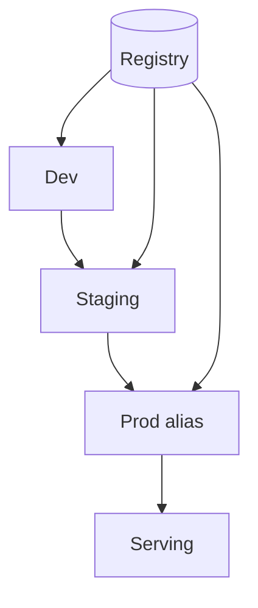

# Prompt and Model Registry

> A unified registry UX and API for promoting, pinning, and discovering prompts and models with stages, aliases, and access control.

## Table of Contents

- [Overview](#overview)
- [Definition](#definition)
- [Why It Matters](#why-it-matters)
- [Uses](#uses)
- [How It Works](#how-it-works)
- [Worked Example](#worked-example)
- [Python Examples](#python-examples)
- [Production Considerations](#production-considerations)
- [Performance Considerations](#performance-considerations)
- [Cost Considerations](#cost-considerations)
- [Security Considerations](#security-considerations)
- [Best Practices](#best-practices)
- [Common Mistakes](#common-mistakes)
- [Interview Preparation](#interview-preparation)
- [Navigation](#navigation)

---

## Overview

This lesson covers **Prompt and Model Registry** inside the `runtime-ops` section of the `mlops-llmops` handbook. Treat it as production engineering guidance: clear definitions, when to apply the idea, system shape, and code you can adapt.

---

## Definition

**Prompt and Model Registry** — A unified registry UX and API for promoting, pinning, and discovering prompts and models with stages, aliases, and access control.

---

## Why It Matters

Scattered prompt files in repos without stages recreate Shadow IT. A registry makes LLM changes operable like model releases.

Without a clear model for this topic, teams ship demos that fail under load, cost, or correctness pressure.

---

## Uses

| Use case | How this applies |
|----------|------------------|
| Aliases | prod/chat_answer → version |
| Stages | dev→staging→prod |
| ACL | Who can promote |
| Diff | Prompt text and metadata diffs |

---

## How It Works

Serve via aliases, not hard-coded versions in app code. Require eval evidence links on promote. Support rollback by repointing aliases atomically.



---

## Worked Example

App requests `alias:prod/support_bot`; registry resolves to `model=m42` + `prompt=p17`. Rollback repoints alias to `m41+p16` in one transaction.

---

## Python Examples

```python
from dataclasses import dataclass, field
from typing import Any

@dataclass
class RegistryEntry:
    name: str
    version: str
    kind: str  # model|prompt|bundle
    meta: dict[str, Any] = field(default_factory=dict)

class PromptModelRegistry:
    def __init__(self):
        self.entries: dict[str, RegistryEntry] = {}
        self.aliases: dict[str, str] = {}  # alias -> name@version
        self.acl_promoters: set[str] = set()

    def publish(self, e: RegistryEntry) -> None:
        self.entries[f"{e.name}@{e.version}"] = e

    def set_alias(self, alias: str, name: str, version: str, actor: str) -> None:
        if actor not in self.acl_promoters:
            raise PermissionError("promote_denied")
        key = f"{name}@{version}"
        if key not in self.entries:
            raise KeyError(key)
        self.aliases[alias] = key

    def resolve(self, alias: str) -> RegistryEntry:
        key = self.aliases[alias]
        return self.entries[key]

    def rollback_alias(self, alias: str, previous_key: str, actor: str) -> None:
        if actor not in self.acl_promoters:
            raise PermissionError("promote_denied")
        if previous_key not in self.entries:
            raise KeyError(previous_key)
        self.aliases[alias] = previous_key

```

---

## Production Considerations

- Log request IDs across orchestration steps.
- Fail closed on auth and policy; degrade only where product explicitly allows it.
- Keep feature flags for prompt/model swaps.

## Performance Considerations

- Bound concurrency to the model provider.
- Stream when UX needs time-to-first-token.
- Cache stable sub-results carefully with invalidation rules.

## Cost Considerations

- Track tokens and tool calls per feature / tenant.
- Prefer smaller models for routers and classifiers.
- Cap max tokens and tool-loop iterations.

## Security Considerations

- Never put secrets in prompts.
- Treat model output as untrusted until validated.
- Enforce tenant isolation on retrieval and tools.

---

## Best Practices

1. Version models, prompts, datasets, and indexes as first-class artifacts.
2. Gate promotions on eval suites with explicit floors.
3. Track online drift and user feedback into curated datasets.
4. Keep environment parity for staging and prod serving.
5. Own rollback paths for every promoted change.

---

## Common Mistakes

- Shipping prompt changes without registry or eval.
- Training on leaking eval data.
- No owner for production model incidents.
- Indexes rebuilt silently without version pins.
- Feedback collected but never sampled into training/eval.

---

## Interview Preparation

**Q: How does LLMOps differ from classic MLOps?**

A: LLMOps adds prompts, traces, retrieval indexes, and judge/eval pipelines as versioned artifacts alongside models and datasets — with different drift and cost profiles.

**Q: What must be versioned for an LLM feature?**

A: Code, prompt templates, model/adapter ids, retrieval index build, tool schemas, and the eval suite that certified the release.

**Q: How do you roll back safely?**

A: Pin previous artifact bundle (model+prompt+index), flip traffic via registry stage, verify online metrics, and keep data plane compatible.

---

## Navigation

- **Section hub:** [README](README.md)
- **Topic hub:** [../README.md](../README.md)
