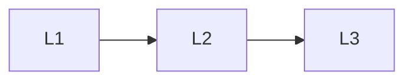

# Runtime Ops

> Section of the **mlops-llmops** handbook.

## Lessons

| # | Lesson |
|---|--------|
| 1 | [Feedback Loops](01-feedback-loops.md) |
| 2 | [Drift Detection](02-drift-detection.md) |
| 3 | [Prompt and Model Registry](03-prompt-model-registry.md) |

**Topic hub:** [../README.md](../README.md)
