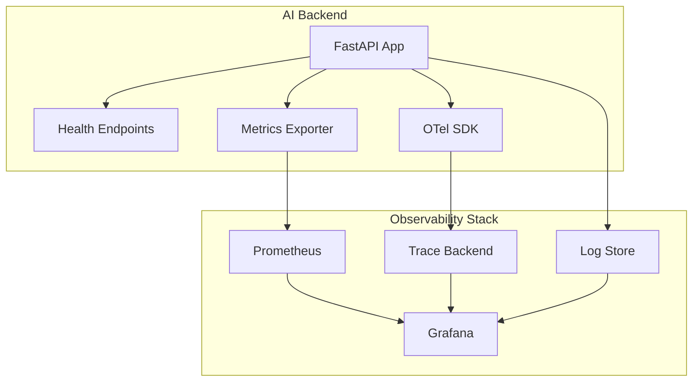
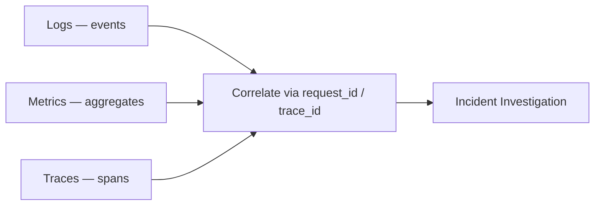
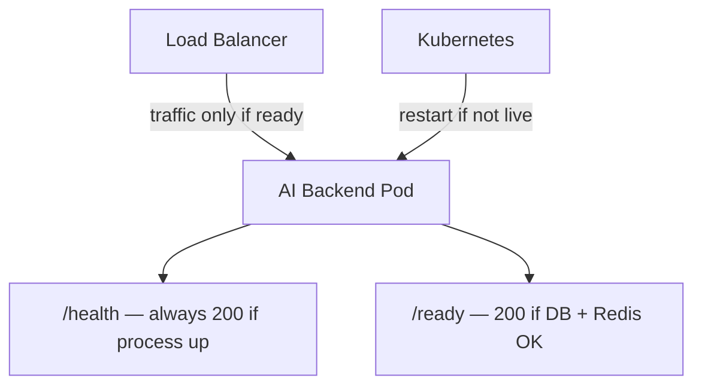
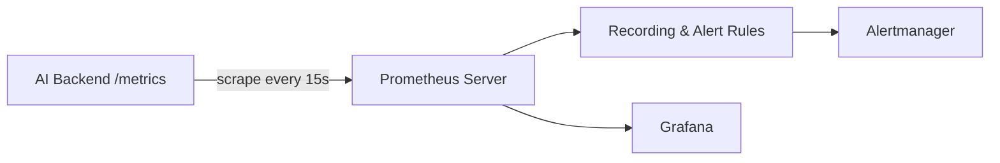
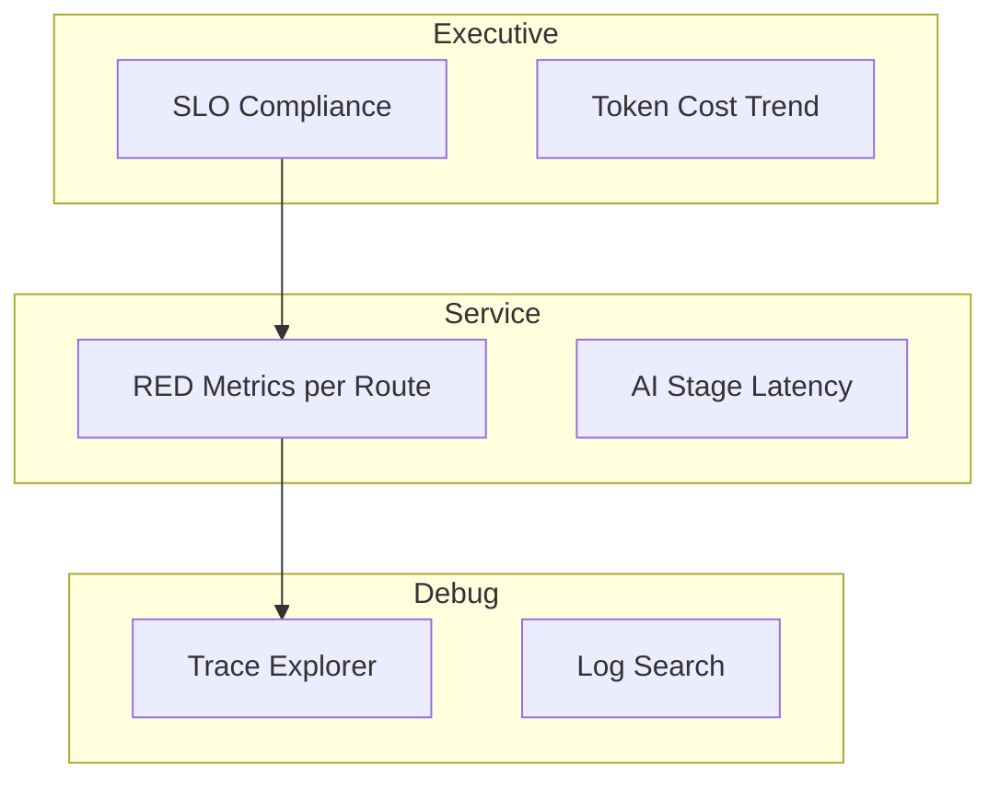
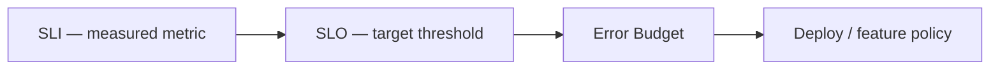

# Monitoring Foundation for AI Backends

> high-level reference for observing AI backends in production — health endpoints, metrics, traces, and the standard open-source observability stack.

## Table of Contents

- [Overview](#overview)
- [Why Monitoring Matters for AI Backends](#why-monitoring-matters-for-ai-backends)
- [The Three Pillars of Observability](#the-three-pillars-of-observability)
- [Health Endpoints](#health-endpoints)
- [Metrics Fundamentals](#metrics-fundamentals)
- [AI-Specific Metrics](#ai-specific-metrics)
- [Distributed Tracing](#distributed-tracing)
- [OpenTelemetry Overview](#opentelemetry-overview)
- [Prometheus Overview](#prometheus-overview)
- [Grafana Overview](#grafana-overview)
- [Alerting Basics](#alerting-basics)
- [SLIs and SLOs for AI Services](#slis-and-slos-for-ai-services)
- [Instrumentation Strategy](#instrumentation-strategy)
- [Best Practices](#best-practices)
- [Production Considerations](#production-considerations)
- [Common Mistakes](#common-mistakes)
- [Interview Preparation](#interview-preparation)
- [Navigation](#navigation)

---

## Overview

Monitoring tells you **whether your AI backend is healthy, fast, and cost-effective** — before users file tickets.
Logs explain what happened on one request; metrics show trends across thousands; traces show where time is spent in multi-stage pipelines.

This document is a **deep dive**. It is intentionally **high-level** — enough to design and discuss production observability without diving into vendor-specific setup guides.

It assumes you have read:

- [Configuration and Secrets](../foundations/configuration-and-secrets.md) — observability endpoints and credentials in settings
- [Backend Logging for AI](../logging/backend-logging-for-ai.md) — structured logs that complement metrics and traces



> **Production Standard:** Every AI backend exposes health endpoints, emits RED metrics (rate, errors, duration), instruments LLM and retrieval stages with traces, and dashboards alerts on SLOs — not individual timeouts.

---

## Why Monitoring Matters for AI Backends

| Challenge | Monitoring Answer |
|-----------|-------------------|
| "Chat is slow" | p99 latency by stage: embed, retrieve, generate |
| "Costs doubled overnight" | Token rate per tenant, model, route |
| "Quality dropped" | Retrieval hit rate, empty-context rate |
| "Provider is down" | Error rate by provider, circuit breaker state |
| "Pod keeps restarting" | Liveness vs readiness failure reasons |
| "Which deploy caused it?" | Metric change correlated with deploy timestamp |

AI backends have **variable latency**, **external dependencies**, and **per-request cost**.
Traditional uptime checks are necessary but not sufficient — you need stage-level visibility.

See [Backend Fundamentals for AI](../backend-engineering/backend-fundamentals-for-ai.md) for the `/health` endpoint pattern introduced in this handbook.

---

## The Three Pillars of Observability

| Pillar | Question It Answers | AI Backend Example |
|--------|---------------------|-------------------|
| **Logs** | What happened on this request? | `request_id=abc`, retrieval returned 0 chunks |
| **Metrics** | How is the system behaving over time? | p99 `llm_latency_ms` = 4.2s |
| **Traces** | Where did time go in this request? | 200ms embed → 800ms retrieve → 3.5s generate |



### How They Work Together

1. **Alert fires** — error rate > 5% for 5 minutes (metric).
2. **Dashboard** — drill into `llm_provider=openai` error spike (metric labels).
3. **Trace** — find slow spans in retrieval (trace).
4. **Logs** — read `request_id` from trace, find exact provider error body (log).

Cross-link logs and traces by including `trace_id` in log context — see [Backend Logging for AI](../logging/backend-logging-for-ai.md).

---

## Health Endpoints

Health endpoints let orchestrators (Kubernetes, ECS, load balancers) determine **whether to route traffic** and **whether to restart** a process.

### Endpoint Types

| Endpoint | Purpose | Checks | Failure Action |
|----------|---------|--------|----------------|
| `/health` or `/healthz` | Liveness | Process is running | Restart pod |
| `/ready` or `/readyz` | Readiness | Can serve traffic | Remove from load balancer |
| `/startup` | Startup probe | Slow initialization complete | Wait before liveness |

### Minimal Liveness

```python
@app.get("/health")
async def health() -> dict[str, str]:
    return {"status": "ok"}
```

Liveness should be **cheap** — no external dependency calls.
If liveness checks the database, a DB blip kills all pods.

### Readiness with Dependencies

```python
@app.get("/ready")
async def ready(
    db: Database = Depends(get_db),
    redis: Redis = Depends(get_redis),
) -> dict[str, str]:
    await db.execute("SELECT 1")
    await redis.ping()
    return {"status": "ready"}
```

For AI backends, readiness often includes:

| Dependency | Why |
|------------|-----|
| PostgreSQL | Conversation history, metadata |
| Redis | Rate limiting, session cache |
| Vector DB | RAG retrieval |
| Optional: LLM provider | Debatable — may prefer degraded mode |

### AI-Specific Health Considerations

| Pattern | Recommendation |
|---------|----------------|
| Check LLM on every `/ready` | Avoid — adds latency and cost; use synthetic canary job instead |
| Degraded readiness | Serve cached answers if vector DB down — document policy |
| Embedding model loaded | For local models, include model load status in `/ready` |
| Warm-up | Use startup probe for model loading (30–120s) |



---

## Metrics Fundamentals

Metrics are **numeric measurements over time** — counters, gauges, and histograms.

### Metric Types

| Type | Description | AI Example |
|------|-------------|------------|
| **Counter** | Monotonically increasing | `llm_requests_total` |
| **Gauge** | Point-in-time value | `active_streams`, `queue_depth` |
| **Histogram** | Distribution of values | `request_duration_seconds` buckets |

### RED Method (Request-Driven Services)

For each endpoint or operation, track:

| Metric | Meaning |
|--------|---------|
| **Rate** | Requests per second |
| **Errors** | Failed requests per second |
| **Duration** | Latency distribution |

Apply RED to `/v1/chat`, `/v1/embed`, and internal operations like `rag.retrieve`.

### USE Method (Resources)

For infrastructure resources:

| Metric | Meaning |
|--------|---------|
| **Utilization** | CPU, GPU, memory % |
| **Saturation** | Queue depth, thread pool exhaustion |
| **Errors** | OOM kills, connection refused |

### Label Cardinality Warning

Labels enable slicing — but **high cardinality kills metrics backends**.

| Good Labels | Bad Labels |
|-------------|------------|
| `method`, `route`, `status_code`, `model` | `user_id`, `request_id`, `prompt_hash` |
| `provider`, `tenant_tier` | Full `tenant_id` (unless few tenants) |

Aggregate per-tenant cost in billing pipelines, not per-request metric labels.

---

## AI-Specific Metrics

Beyond generic HTTP metrics, instrument AI-specific stages:

### LLM Metrics

| Metric | Type | Labels |
|--------|------|--------|
| `llm_requests_total` | Counter | `model`, `provider`, `status` |
| `llm_tokens_total` | Counter | `model`, `direction` (input/output) |
| `llm_latency_seconds` | Histogram | `model`, `operation` |
| `llm_errors_total` | Counter | `provider`, `error_type` |

### RAG Metrics

| Metric | Type | Labels |
|--------|------|--------|
| `retrieval_latency_seconds` | Histogram | `index_name` |
| `retrieval_chunks_found` | Histogram | `index_name` |
| `retrieval_empty_total` | Counter | `index_name` |
| `embedding_latency_seconds` | Histogram | `model` |

### Agent Metrics

| Metric | Type | Labels |
|--------|------|--------|
| `agent_iterations_total` | Histogram | `agent_name` |
| `agent_tool_calls_total` | Counter | `tool_name`, `status` |
| `agent_loop_detected_total` | Counter | `agent_name` |

### Cost and Capacity

| Metric | Purpose |
|--------|---------|
| `token_rate` per tenant/tier | Billing alerts |
| `concurrent_streams` | Capacity planning |
| `queue_depth` | Worker backlog |

Push token counts to metrics — not logs — for efficient aggregation.

---

## Distributed Tracing

A **trace** represents one request's journey through your system.
Each unit of work is a **span** with a name, duration, and attributes.

### AI Pipeline Span Example

```mermaid
gantt
  title Chat Request Trace
  dateFormat X
  axisFormat %L ms

  section HTTP
  POST /v1/chat :0, 4200

  section RAG
  embed_query :100, 200
  retrieve :300, 900

  section LLM
  generate :1200, 4000
```



### What to Trace

| Span Name | Attributes |
|-----------|------------|
| `http.request` | `http.method`, `http.route`, `http.status_code` |
| `rag.embed_query` | `embedding.model`, `query.length` |
| `rag.retrieve` | `index.name`, `chunks.found` |
| `llm.complete` | `llm.model`, `llm.input_tokens`, `llm.output_tokens` |
| `agent.tool_call` | `tool.name`, `tool.status` |

### Trace Context Propagation

Propagate trace context across:

- Inbound HTTP (from gateway)
- Outbound HTTP (to LLM provider if supported)
- Message queues (inject trace context in message headers)
- Background workers

Link traces to logs via `trace_id` in log context.

---

## OpenTelemetry Overview

[OpenTelemetry](https://opentelemetry.io/) (OTel) is the **vendor-neutral standard** for traces, metrics, and logs instrumentation.

### Core Concepts

| Concept | Description |
|---------|-------------|
| **SDK** | Library embedded in your app |
| **Instrumentation** | Auto or manual hooks for frameworks |
| **Exporter** | Sends data to a backend (OTLP, Prometheus, Jaeger) |
| **Collector** | Optional middleware agent for processing/routing |

### OTel in Python AI Backends

```python
# Conceptual setup — see OTel docs for full version-specific config
from opentelemetry import trace
from opentelemetry.sdk.trace import TracerProvider
from opentelemetry.sdk.trace.export import BatchSpanProcessor
from opentelemetry.exporter.otlp.proto.grpc.trace_exporter import OTLPSpanExporter

provider = TracerProvider()
provider.add_span_processor(BatchSpanProcessor(OTLPSpanExporter()))
trace.set_tracer_provider(provider)

tracer = trace.get_tracer(__name__)


async def complete(prompt: str) -> str:
    with tracer.start_as_current_span("llm.complete") as span:
        span.set_attribute("llm.model", "gpt-4o")
        result = await client.complete(prompt)
        span.set_attribute("llm.input_tokens", result.input_tokens)
        span.set_attribute("llm.output_tokens", result.output_tokens)
        return result.content
```

### Auto-Instrumentation

OTel provides auto-instrumentation for:

| Library | What It Traces |
|---------|----------------|
| FastAPI / Starlette | HTTP requests |
| httpx / requests | Outbound HTTP |
| SQLAlchemy | Database queries |
| Redis | Cache operations |

Enable auto-instrumentation for boilerplate; add **manual spans** for AI stages auto-instrumentation cannot see.

### OTLP Export

Most production setups export via **OTLP** (OpenTelemetry Protocol) to:

- OpenTelemetry Collector → Jaeger / Tempo / Datadog
- Direct to managed observability backends

Configure exporter endpoint via settings — see [Configuration and Secrets](../foundations/configuration-and-secrets.md).

---

## Prometheus Overview

[Prometheus](https://prometheus.io/) is a **time-series metrics database** with a pull-based scraping model — the de facto standard in Kubernetes environments.

### How Prometheus Works



1. Your app exposes a `/metrics` endpoint (often via `prometheus_client` or OTel Prometheus exporter).
2. Prometheus scrapes it on an interval.
3. PromQL queries aggregate time series.
4. Alertmanager sends notifications when rules fire.

### PromQL Examples (Conceptual)

```promql
# Request rate
rate(http_requests_total{route="/v1/chat"}[5m])

# p99 latency
histogram_quantile(0.99, rate(request_duration_seconds_bucket[5m]))

# LLM error ratio
rate(llm_errors_total[5m]) / rate(llm_requests_total[5m])
```

### Python Exposure

```python
from prometheus_client import Counter, Histogram, generate_latest

llm_requests = Counter("llm_requests_total", "LLM calls", ["model", "status"])
llm_latency = Histogram("llm_latency_seconds", "LLM latency", ["model"])

@app.get("/metrics")
async def metrics():
    return Response(generate_latest(), media_type="text/plain")
```

In production, protect `/metrics` with network policy or auth — it can leak operational detail.

### When to Choose Prometheus

| Fit | Misfit |
|-----|--------|
| Kubernetes deployments | Serverless with very short-lived functions (without push gateway) |
| Long-term trend analysis | High-cardinality per-user metrics |
| Open-source, self-hosted | Fully managed-only shops (consider cloud alternatives) |

---

## Grafana Overview

[Grafana](https://grafana.com/) is a **visualization and dashboarding** platform that queries Prometheus, Loki, Tempo, and dozens of other data sources.

### Typical AI Backend Dashboard Panels

| Panel | Data Source | Query Concept |
|-------|-------------|---------------|
| Request rate | Prometheus | `rate(http_requests_total[5m])` |
| Error rate | Prometheus | 5xx / total |
| p50/p95/p99 latency | Prometheus | `histogram_quantile` |
| Token usage | Prometheus | `rate(llm_tokens_total[1h])` |
| Retrieval empty rate | Prometheus | `rate(retrieval_empty_total[5m])` |
| Active alerts | Alertmanager | Firing alerts list |
| Trace search | Tempo/Jaeger | Slowest `llm.complete` spans |
| Recent errors | Loki | `{level="ERROR"} |= "llm_call_failed"` |

### Dashboard Layers



### Alerting in Grafana

Grafana can alert directly or delegate to Alertmanager.
Prefer **Alertmanager** for routing, silencing, and on-call integration in Prometheus stacks.

---

## Alerting Basics

### What to Alert On

| Alert | Rationale |
|-------|-----------|
| Error rate > SLO threshold | User-visible failures |
| p99 latency > SLO | Degraded experience |
| Readiness failures | Traffic routed to broken pods |
| Token rate anomaly | Cost or abuse |
| Queue depth sustained high | Worker capacity issue |
| Provider error rate spike | External dependency failure |

### What Not to Alert On

| Anti-Pattern | Why |
|--------------|-----|
| Single LLM timeout | Noise — providers have tail latency |
| Every 429 | Use rate-based alerts with thresholds |
| DEBUG log volume | Fix logging, do not page |

### Alert Severity

| Severity | Response | Example |
|----------|----------|---------|
| P1 — Critical | Immediate page | API down, data loss |
| P2 — High | Business hours / soon | Error rate 5x baseline |
| P3 — Warning | Next business day | Disk 80% full |
| Info | Ticket only | Deploy completed |

---

## SLIs and SLOs for AI Services

### Service Level Indicators (SLIs)

Measurable aspects of service quality:

| SLI | Measurement |
|-----|-------------|
| Availability | % of successful chat requests |
| Latency | % of requests < 5s (product-dependent) |
| Quality proxy | % of requests with `chunks_found > 0` |
| Cost efficiency | Tokens per successful answer |

### Service Level Objectives (SLOs)

Targets over a rolling window (e.g., 30 days):

| SLO | Example Target |
|-----|----------------|
| Availability | 99.9% successful responses |
| Latency | 95% of chat requests < 8s |
| Retrieval | 98% of RAG requests find ≥ 1 chunk |

### Error Budget

If availability SLO is 99.9%, you have **0.1% error budget** per month.
When budget is exhausted, freeze risky deploys and focus on reliability.



---

## Instrumentation Strategy

### Phased Rollout

| Phase | Scope |
|-------|-------|
| 1 | Health endpoints + RED HTTP metrics |
| 2 | LLM token/latency metrics |
| 3 | RAG stage metrics |
| 4 | OTel traces for full pipeline |
| 5 | SLO dashboards and alerts |

### Where to Instrument

| Location | Metrics | Traces |
|----------|---------|--------|
| Middleware | HTTP RED | `http.request` span |
| Service layer | Stage counters/histograms | `rag.*`, `llm.*` spans |
| Provider clients | Provider errors, latency | Child spans |
| Workers | Job duration, queue depth | Linked trace from enqueue |

Do not instrument inside every helper function — focus on **boundaries**.

### Configuration

Expose observability settings via [Configuration Management for Backends](../backend-engineering/configuration-management-for-backends.md):

```python
class Settings(BaseSettings):
    otel_exporter_endpoint: str | None = None
    metrics_enabled: bool = True
    trace_sample_rate: float = 1.0  # reduce in high-traffic prod
```

---

## Best Practices

| Practice | Benefit |
|----------|---------|
| Separate liveness and readiness | Correct orchestrator behavior |
| RED metrics per route | Fast incident triage |
| AI stage metrics | Pinpoint slow/failing pipeline step |
| OTel for vendor portability | Avoid lock-in |
| Low-cardinality labels | Stable Prometheus performance |
| SLO-based alerts | Reduce alert fatigue |
| Correlate logs + traces | Faster root cause analysis |
| Token metrics to Prometheus | Cost visibility without log volume |
| Protect `/metrics` endpoint | Operational security |
| Dashboard per audience | Exec SLOs vs engineer debug views |

---

## Production Considerations

- **Sampling** — trace 100% in staging; sample 1–10% in high-traffic production.
- **Cardinality** — never label metrics with `request_id` or `user_id`.
- **Cost** — managed observability priced per span/metric series; plan label sets.
- **Multi-region** — federate Prometheus or use managed global metrics.
- **Provider blind spots** — LLM provider latency inside your spans; their internal queue is invisible.
- **Cold start** — serverless AI functions need startup probes and adjusted SLOs.
- **Synthetic checks** — periodic canary prompts detect quality regressions metrics miss.
- **Deploy markers** — annotate Grafana with deploy times for correlation.

---

## Common Mistakes

| Mistake | Impact | Fix |
|---------|--------|-----|
| DB check in liveness probe | Cascading pod kills | Move dependency checks to `/ready` |
| No readiness endpoint | Traffic to broken pods | Implement `/ready` |
| Alerting on single slow request | Alert fatigue | Rate-based SLO alerts |
| `user_id` as metric label | Cardinality explosion | Aggregate in billing pipeline |
| Metrics only, no traces | Cannot see stage breakdown | Add OTel spans |
| Traces only, no metrics | No trend dashboards | RED + AI-specific counters |
| Unprotected `/metrics` | Information disclosure | Network policy or auth |
| 100% trace sampling at scale | Cost and performance hit | Head-based sampling |
| Ignoring token metrics | Surprise LLM bills | `llm_tokens_total` counter |
| Dashboards without SLOs | Pretty graphs, no accountability | Define SLIs and error budgets |

---

## Interview Preparation

### Frequently Asked Questions

**Q1: What is the difference between liveness and readiness probes?**

> **Strong answer:** Liveness asks "is the process alive?" — failure causes restart. Readiness asks "can this instance serve traffic?" — failure removes it from the load balancer. Liveness should be cheap (no DB calls). Readiness checks dependencies like PostgreSQL and Redis. For AI backends, avoid expensive LLM calls in probes.

**Q2: How would you monitor a RAG pipeline in production?**

> **Strong answer:** RED metrics on the chat endpoint. Stage histograms for embed, retrieve, rerank, generate. Counter for empty retrieval. Token counters by model. OTel spans linking stages in one trace. Logs with `request_id` for detail. Alerts on error rate and p99 latency SLOs, not single slow requests.

**Q3: What is OpenTelemetry and why use it?**

> **Strong answer:** Vendor-neutral observability standard for traces, metrics, and logs. Instrument once with OTel SDK, export to Jaeger, Tempo, Datadog, or others. Auto-instruments FastAPI and httpx; manual spans for AI-specific stages. Avoids lock-in to proprietary agents.

**Q4: How do you avoid high cardinality in Prometheus?**

> **Strong answer:** Limit labels to bounded sets: route, model, provider, status — not request_id or user_id. Use logs or traces for per-request detail. Aggregate per-tenant metrics only for known tenant tiers or billing accounts, not every free user.

### Real-World Scenario

**Scenario:** p99 chat latency jumped from 3s to 12s after enabling a new reranker. Error rate is unchanged.

> **Discussion points:** Check `rerank_latency_seconds` histogram; compare deploy annotation; trace slow requests — is rerank or LLM the parent span?; check `retrieval_chunks_found` — more chunks = slower rerank; review CPU/memory on reranker service; consider feature flag rollback via [Configuration Management for Backends](../backend-engineering/configuration-management-for-backends.md).

---

## Navigation

### Prerequisites

- [Configuration and Secrets](../foundations/configuration-and-secrets.md) — observability config and secrets
- [Backend Logging for AI](../logging/backend-logging-for-ai.md) — logs correlated with traces
- [Backend Fundamentals for AI](../backend-engineering/backend-fundamentals-for-ai.md) — health endpoint basics

### Related Topics

- [Logging and Error Handling](../logging/logging-and-error-handling.md) — error signals and retries
- [Configuration Management for Backends](../backend-engineering/configuration-management-for-backends.md) — feature flags for observability toggles
- [Observability Domain](../observability/README.md) — extended observability content

### Next Topics

- [Observability Domain](../observability/README.md)
- [Production Incidents Domain](../production-incidents/README.md)
- [Performance Optimization](../performance-optimization/README.md)

### Future Reading

- [CICD Domain](../cicd/README.md) — deploy annotations and synthetic checks in pipelines
- [Cloud Deployment](../cloud-deployment/README.md) — managed observability on cloud platforms

---

## See Also

- [Monitoring Domain README](README.md)
- [Backend Logging for AI](../logging/backend-logging-for-ai.md)
- [Master Index](../../meta/indexes/MASTER-INDEX.md)

## Changelog

| Version | Date | Changes |
|---------|------|---------|
| 1.0 | 2026-07-13 | Initial release |
