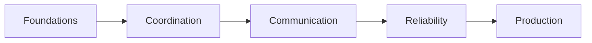

# Multi-Agent Systems

> Coordinating specialized agents with protocols, shared memory, and reliability controls — nested Handbooks curriculum.

**Prerequisites:** [Agentic AI](../agentic-ai/README.md) · [AI Agents](../ai-agents/README.md)  
**Unlocks:** [AI Evaluation](../ai-evaluation/README.md) · [MLOps & LLMOps](../mlops-llmops/README.md)

Start with a section hub below (or expand the topic in the left sidebar).

---

## Sections

| # | Section | What you will learn | Hub |
|---|---------|---------------------|-----|
| 1 | **Foundations** | Fundamentals, when it helps, single vs multi | [foundations/](foundations/README.md) |
| 2 | **Coordination** | Patterns, debate, manager-worker, blackboard/A2A | [coordination/](coordination/README.md) |
| 3 | **Communication** | Protocols, shared memory, handoffs | [communication/](communication/README.md) |
| 4 | **Reliability** | When not to, deadlocks, cost blowups | [reliability/](reliability/README.md) |
| 5 | **Production** | Observability, team eval, case studies | [production/](production/README.md) |

---

## Hierarchy

### Foundations

| # | Topic |
|---|-------|
| 1 | [Multi-Agent Fundamentals](foundations/01-multi-agent-fundamentals.md) |
| 2 | [When Multi-Agent Helps](foundations/02-when-multi-agent-helps.md) |
| 3 | [Single vs Multi-Agent Tradeoffs](foundations/03-single-vs-multi.md) |

### Coordination

| # | Topic |
|---|-------|
| 1 | [Coordination Patterns](coordination/01-coordination-patterns.md) |
| 2 | [Debate and Critique](coordination/02-debate-and-critique.md) |
| 3 | [Manager-Worker Pattern](coordination/03-manager-worker.md) |
| 4 | [Blackboard and Agent-to-Agent (A2A)](coordination/04-blackboard-and-a2a.md) |

### Communication

| # | Topic |
|---|-------|
| 1 | [Multi-Agent Protocols](communication/01-protocols.md) |
| 2 | [Shared Memory](communication/02-shared-memory.md) |
| 3 | [Agent Handoffs](communication/03-handoffs.md) |

### Reliability

| # | Topic |
|---|-------|
| 1 | [When Not to Multi-Agent](reliability/01-when-not-to-multi-agent.md) |
| 2 | [Deadlocks and Loops](reliability/02-deadlocks-and-loops.md) |
| 3 | [Cost Blowups](reliability/03-cost-blowups.md) |

### Production

| # | Topic |
|---|-------|
| 1 | [Multi-Agent Observability](production/01-observability.md) |
| 2 | [Team Evaluation](production/02-team-eval.md) |
| 3 | [Multi-Agent Case Studies](production/03-case-studies.md) |

---

## Definition

**Multi-agent systems** compose multiple roles that communicate and coordinate to complete goals — only when the team beats a strong single-agent baseline.

---

## Related topics

- [Agentic AI](../agentic-ai/README.md)
- [AI Agents](../ai-agents/README.md)
- [AI Evaluation](../ai-evaluation/README.md)
- [Domains overview](../README.md)
- [Master Index](../../meta/indexes/MASTER-INDEX.md)
