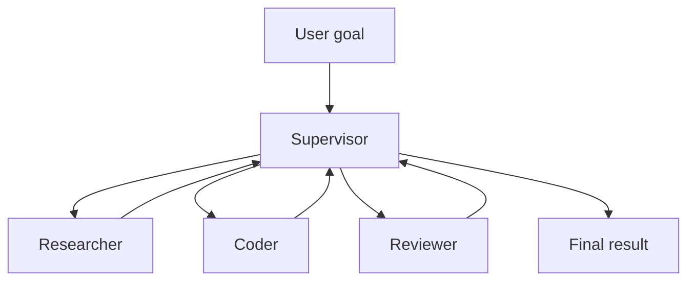

# Multi-Agent Systems

> Multiple cooperating (or competing) agents — roles, coordination patterns, and when multi-agent is worth the complexity.

**Prerequisites:** [Agentic AI](../agentic-ai/README.md) · [AI Agents](../ai-agents/README.md)  
**Unlocks:** [MCP](../mcp/README.md) · [AI System Design](../ai-system-design/README.md)

---

## Definition

**Multi-agent systems (MAS)** coordinate multiple agent instances/roles that communicate to solve tasks. Patterns include supervisor–workers, peer debate, pipeline stages, and market/auction styles. Complexity rises quickly — use MAS when specialization or parallelism clearly pays off.

---

## Learning path

---

## Documents

| # | Topic | Document |
|---|-------|----------|
| 1 | Multi-agent fundamentals | [multi-agent-fundamentals.md](multi-agent-fundamentals.md) |
| 2 | Coordination patterns | [coordination-patterns.md](coordination-patterns.md) |
| 3 | When not to multi-agent | [when-not-to-multi-agent.md](when-not-to-multi-agent.md) |

---

## Related topics

- [AI Agents — multi-agent doc](../ai-agents/multi-agent-systems.md)
- [A2A](../a2a/README.md)
- [MCP](../mcp/README.md)

---

## See also

- [Domains overview](../README.md)
- [Learning Roadmap](../../meta/roadmap.md)
- [Master Index](../../meta/indexes/MASTER-INDEX.md)
