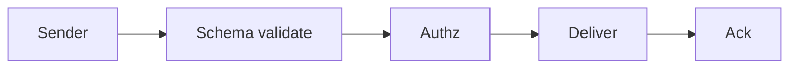

# Multi-Agent Protocols

> Message schemas, intents, acknowledgements, and versioning for reliable agent communication — treating agent chat as an API.

## Table of Contents

- [Overview](#overview)
- [Definition](#definition)
- [Why It Matters](#why-it-matters)
- [Uses](#uses)
- [How It Works](#how-it-works)
- [Worked Example](#worked-example)
- [Python Examples](#python-examples)
- [Production Considerations](#production-considerations)
- [Performance Considerations](#performance-considerations)
- [Cost Considerations](#cost-considerations)
- [Security Considerations](#security-considerations)
- [Best Practices](#best-practices)
- [Common Mistakes](#common-mistakes)
- [Interview Preparation](#interview-preparation)
- [Navigation](#navigation)

---

## Overview

This lesson covers **Multi-Agent Protocols** inside the `communication` section of the `multi-agent-systems` handbook. Treat it as production engineering guidance: clear definitions, when to apply the idea, system shape, and code you can adapt.

---

## Definition

**Multi-Agent Protocols** — Message schemas, intents, acknowledgements, and versioning for reliable agent communication — treating agent chat as an API.

---

## Why It Matters

Natural language between agents is flexible and fragile. Protocols make handoffs testable and secure.

Without a clear model for this topic, teams ship demos that fail under load, cost, or correctness pressure.

---

## Uses

| Use case | How this applies |
|----------|------------------|
| Task assign | intent=assign + schema |
| Result return | intent=result + artifacts |
| Negotiate | intent=propose/accept/reject |
| Control | intent=cancel/budget |

---

## How It Works

Version your envelopes. Validate JSON schemas before the recipient LLM sees content. Authenticate sender identity in the orchestrator.



---

## Worked Example

Worker rejects malformed assign missing `shard_id`; coordinator retries with fixed payload — no LLM involved in the reject path.

---

## Python Examples

```python
from dataclasses import dataclass
from typing import Any
import jsonschema

ENVELOPE = {
    "type": "object",
    "required": ["v", "id", "from", "to", "intent", "body"],
    "properties": {
        "v": {"type": "integer"},
        "id": {"type": "string"},
        "from": {"type": "string"},
        "to": {"type": "string"},
        "intent": {"enum": ["assign", "result", "propose", "accept", "reject", "cancel"]},
        "body": {"type": "object"},
    },
}

@dataclass
class ProtocolError(Exception):
    code: str
    detail: str

def validate_envelope(msg: dict) -> dict:
    try:
        jsonschema.validate(msg, ENVELOPE)
    except jsonschema.ValidationError as e:
        raise ProtocolError("schema", str(e.message)) from e
    if msg["v"] != 1:
        raise ProtocolError("version", f"unsupported v={msg['v']}")
    return msg

def handle(msg: dict, handlers: dict) -> dict:
    msg = validate_envelope(msg)
    fn = handlers.get(msg["intent"])
    if not fn:
        raise ProtocolError("intent", msg["intent"])
    return fn(msg)

```

---

## Production Considerations

- Log request IDs across orchestration steps.
- Fail closed on auth and policy; degrade only where product explicitly allows it.
- Keep feature flags for prompt/model swaps.

## Performance Considerations

- Bound concurrency to the model provider.
- Stream when UX needs time-to-first-token.
- Cache stable sub-results carefully with invalidation rules.

## Cost Considerations

- Track tokens and tool calls per feature / tenant.
- Prefer smaller models for routers and classifiers.
- Cap max tokens and tool-loop iterations.

## Security Considerations

- Never put secrets in prompts.
- Treat model output as untrusted until validated.
- Enforce tenant isolation on retrieval and tools.

---

## Best Practices

1. Start from a strong single agent; split only with measured gains.
2. Define message schemas and ownership of shared state.
3. Cap debate rounds and worker fan-out hard.
4. Measure team cost and latency, not just final quality.
5. Keep a collapse-to-single-agent feature flag.

---

## Common Mistakes

- Spawning agents because the framework makes it easy.
- No owner for conflicts on the blackboard.
- Unbounded debate that never converges.
- Duplicating the same retrieval across workers.
- Missing deadlock and cost-blowup monitors.

---

## Interview Preparation

**Q: When does multi-agent help?**

A: When specialization, parallelism, or critique measurably improves quality/latency enough to pay coordination cost — proven against a single-agent baseline.

**Q: What are common failure modes?**

A: Deadlocks, infinite critique loops, cost blowups from fan-out, and inconsistent shared state without locking or ownership.

**Q: How do you evaluate a multi-agent system?**

A: Joint task success, trajectory/team traces, cost per success, contention metrics, and ablation vs single agent on the same suite.

---

## Navigation

- **Section hub:** [README](README.md)
- **Topic hub:** [../README.md](../README.md)
