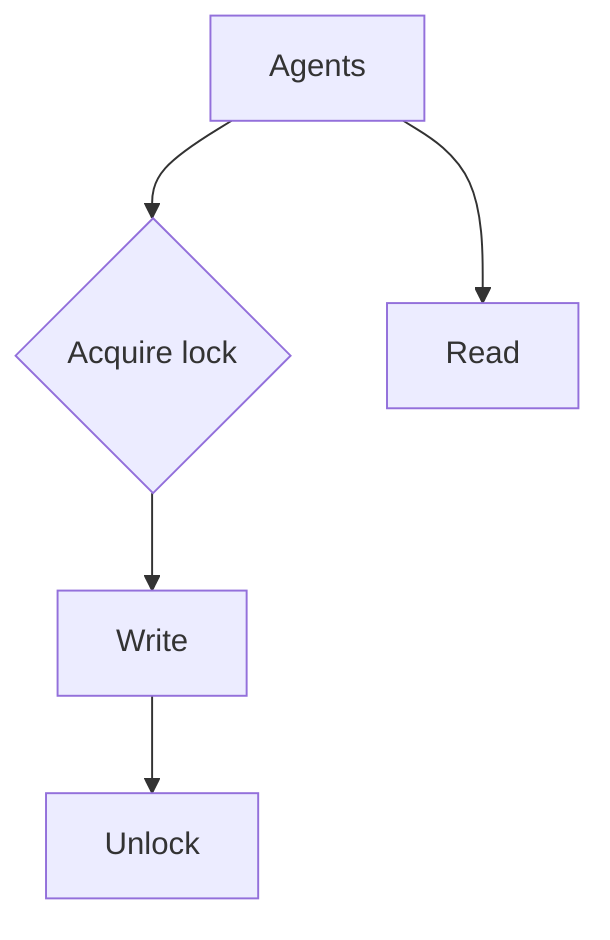

# Shared Memory

> Designing memory visible to multiple agents: scopes, locking, conflict resolution, and tenant isolation.

## Table of Contents

- [Overview](#overview)
- [Definition](#definition)
- [Why It Matters](#why-it-matters)
- [Uses](#uses)
- [How It Works](#how-it-works)
- [Worked Example](#worked-example)
- [Python Examples](#python-examples)
- [Production Considerations](#production-considerations)
- [Performance Considerations](#performance-considerations)
- [Cost Considerations](#cost-considerations)
- [Security Considerations](#security-considerations)
- [Best Practices](#best-practices)
- [Common Mistakes](#common-mistakes)
- [Interview Preparation](#interview-preparation)
- [Navigation](#navigation)

---

## Overview

This lesson covers **Shared Memory** inside the `communication` section of the `multi-agent-systems` handbook. Treat it as production engineering guidance: clear definitions, when to apply the idea, system shape, and code you can adapt.

---

## Definition

**Shared Memory** — Designing memory visible to multiple agents: scopes, locking, conflict resolution, and tenant isolation.

---

## Why It Matters

Shared memory is how teams collaborate — and how they corrupt each other's state. Explicit scopes and locks are mandatory.

Without a clear model for this topic, teams ship demos that fail under load, cost, or correctness pressure.

---

## Uses

| Use case | How this applies |
|----------|------------------|
| Scratchpad | Ephemeral per-run team memory |
| Artifact store | Docs, diffs, tables |
| Entity memory | Customer record as SoT |
| Vector share | Careful; easy to leak tenants |

---

## How It Works

Prefer append-only event logs for collaboration; materialize views per agent. Never share raw tenant embeddings across tenants.



---

## Worked Example

Writer and critic share `draft_v3` under lock; critic posts comments as events; writer applies patches from events.

---

## Python Examples

```python
from dataclasses import dataclass, field
from threading import Lock
from typing import Any

@dataclass
class SharedMemory:
    run_id: str
    data: dict[str, Any] = field(default_factory=dict)
    events: list[dict] = field(default_factory=list)
    _lock: Lock = field(default_factory=Lock)

    def append_event(self, agent: str, kind: str, payload: dict) -> None:
        with self._lock:
            self.events.append({"agent": agent, "kind": kind, "payload": payload})

    def put(self, key: str, value: Any, agent: str) -> None:
        with self._lock:
            self.data[key] = value
            self.events.append({"agent": agent, "kind": "put", "payload": {"key": key}})

    def get(self, key: str, default=None):
        with self._lock:
            return self.data.get(key, default)

class TenantGuard:
    def __init__(self, tenant_id: str):
        self.tenant_id = tenant_id

    def key(self, raw: str) -> str:
        return f"{self.tenant_id}::{raw}"

    def assert_owner(self, key: str) -> None:
        if not key.startswith(self.tenant_id + "::"):
            raise PermissionError("cross_tenant_memory")

```

---

## Production Considerations

- Log request IDs across orchestration steps.
- Fail closed on auth and policy; degrade only where product explicitly allows it.
- Keep feature flags for prompt/model swaps.

## Performance Considerations

- Bound concurrency to the model provider.
- Stream when UX needs time-to-first-token.
- Cache stable sub-results carefully with invalidation rules.

## Cost Considerations

- Track tokens and tool calls per feature / tenant.
- Prefer smaller models for routers and classifiers.
- Cap max tokens and tool-loop iterations.

## Security Considerations

- Never put secrets in prompts.
- Treat model output as untrusted until validated.
- Enforce tenant isolation on retrieval and tools.

---

## Best Practices

1. Start from a strong single agent; split only with measured gains.
2. Define message schemas and ownership of shared state.
3. Cap debate rounds and worker fan-out hard.
4. Measure team cost and latency, not just final quality.
5. Keep a collapse-to-single-agent feature flag.

---

## Common Mistakes

- Spawning agents because the framework makes it easy.
- No owner for conflicts on the blackboard.
- Unbounded debate that never converges.
- Duplicating the same retrieval across workers.
- Missing deadlock and cost-blowup monitors.

---

## Interview Preparation

**Q: When does multi-agent help?**

A: When specialization, parallelism, or critique measurably improves quality/latency enough to pay coordination cost — proven against a single-agent baseline.

**Q: What are common failure modes?**

A: Deadlocks, infinite critique loops, cost blowups from fan-out, and inconsistent shared state without locking or ownership.

**Q: How do you evaluate a multi-agent system?**

A: Joint task success, trajectory/team traces, cost per success, contention metrics, and ablation vs single agent on the same suite.

---

## Navigation

- **Section hub:** [README](README.md)
- **Topic hub:** [../README.md](../README.md)
