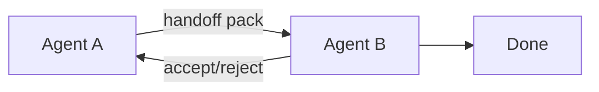

# Agent Handoffs

> Transferring control, context, and responsibility between agents (or humans) with clear acceptance criteria and rollback.

## Table of Contents

- [Overview](#overview)
- [Definition](#definition)
- [Why It Matters](#why-it-matters)
- [Uses](#uses)
- [How It Works](#how-it-works)
- [Worked Example](#worked-example)
- [Python Examples](#python-examples)
- [Production Considerations](#production-considerations)
- [Performance Considerations](#performance-considerations)
- [Cost Considerations](#cost-considerations)
- [Security Considerations](#security-considerations)
- [Best Practices](#best-practices)
- [Common Mistakes](#common-mistakes)
- [Interview Preparation](#interview-preparation)
- [Navigation](#navigation)

---

## Overview

This lesson covers **Agent Handoffs** inside the `communication` section of the `multi-agent-systems` handbook. Treat it as production engineering guidance: clear definitions, when to apply the idea, system shape, and code you can adapt.

---

## Definition

**Agent Handoffs** — Transferring control, context, and responsibility between agents (or humans) with clear acceptance criteria and rollback.

---

## Why It Matters

Bad handoffs drop context and duplicate work. Treat handoffs like on-call pages: summary, ownership, and acceptance tests.

Without a clear model for this topic, teams ship demos that fail under load, cost, or correctness pressure.

---

## Uses

| Use case | How this applies |
|----------|------------------|
| Warm handoff | Agent A briefs agent B with state pack |
| Cold handoff | B rebuilds from durable state only |
| Human escalate | Pack for operator UI |
| Return path | B returns result to A or coordinator |

---

## How It Works

Handoff packs include goal, constraints, artifacts, attempts, and next suggested action. Require explicit accept. On reject, A retains ownership.



---

## Worked Example

Triage agent hands billing disputes to specialist with ticket pack; specialist accepts; triage stops touching the ticket.

---

## Python Examples

```python
from dataclasses import dataclass, field
from typing import Any

@dataclass
class HandoffPack:
    from_agent: str
    to_agent: str
    goal: str
    constraints: list[str]
    artifacts: dict[str, Any]
    attempts: list[str] = field(default_factory=list)
    acceptance: list[str] = field(default_factory=list)
    status: str = "proposed"  # proposed|accepted|rejected|completed

class HandoffBus:
    def __init__(self):
        self.packs: dict[str, HandoffPack] = {}

    def propose(self, pack_id: str, pack: HandoffPack) -> None:
        self.packs[pack_id] = pack

    def accept(self, pack_id: str, agent: str) -> HandoffPack:
        p = self.packs[pack_id]
        if agent != p.to_agent:
            raise PermissionError("not_recipient")
        p.status = "accepted"
        return p

    def reject(self, pack_id: str, agent: str, reason: str) -> HandoffPack:
        p = self.packs[pack_id]
        if agent != p.to_agent:
            raise PermissionError("not_recipient")
        p.status = "rejected"
        p.attempts.append(f"reject:{reason}")
        return p

def pack_for_human(p: HandoffPack) -> dict:
    return {
        "summary": p.goal,
        "constraints": p.constraints,
        "artifacts": p.artifacts,
        "tried": p.attempts,
        "please_verify": p.acceptance,
    }

```

---

## Production Considerations

- Log request IDs across orchestration steps.
- Fail closed on auth and policy; degrade only where product explicitly allows it.
- Keep feature flags for prompt/model swaps.

## Performance Considerations

- Bound concurrency to the model provider.
- Stream when UX needs time-to-first-token.
- Cache stable sub-results carefully with invalidation rules.

## Cost Considerations

- Track tokens and tool calls per feature / tenant.
- Prefer smaller models for routers and classifiers.
- Cap max tokens and tool-loop iterations.

## Security Considerations

- Never put secrets in prompts.
- Treat model output as untrusted until validated.
- Enforce tenant isolation on retrieval and tools.

---

## Best Practices

1. Start from a strong single agent; split only with measured gains.
2. Define message schemas and ownership of shared state.
3. Cap debate rounds and worker fan-out hard.
4. Measure team cost and latency, not just final quality.
5. Keep a collapse-to-single-agent feature flag.

---

## Common Mistakes

- Spawning agents because the framework makes it easy.
- No owner for conflicts on the blackboard.
- Unbounded debate that never converges.
- Duplicating the same retrieval across workers.
- Missing deadlock and cost-blowup monitors.

---

## Interview Preparation

**Q: When does multi-agent help?**

A: When specialization, parallelism, or critique measurably improves quality/latency enough to pay coordination cost — proven against a single-agent baseline.

**Q: What are common failure modes?**

A: Deadlocks, infinite critique loops, cost blowups from fan-out, and inconsistent shared state without locking or ownership.

**Q: How do you evaluate a multi-agent system?**

A: Joint task success, trajectory/team traces, cost per success, contention metrics, and ablation vs single agent on the same suite.

---

## Navigation

- **Section hub:** [README](README.md)
- **Topic hub:** [../README.md](../README.md)
